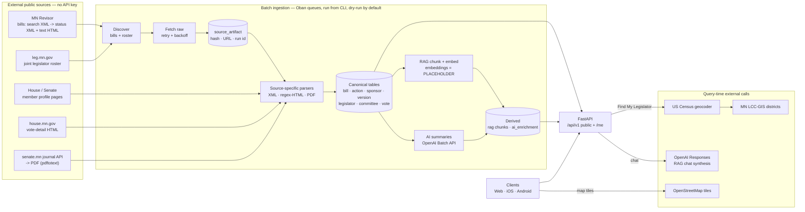

# Data Ingestion — Full-Stack Onboarding Guide

> Practical map of every data source Alethical pulls from, how each is fetched
> and parsed, how the pipeline is orchestrated, and what you need installed.
> Verified against the code on 2026-07-03. Companion design docs:
> [ingestion-pipeline-system-design.md](ingestion-pipeline-system-design.md),
> [rag-ingestion-system-design.md](rag-ingestion-system-design.md),
> [db-schema-system-design.md](db-schema-system-design.md).

## TL;DR mental model

Alethical ingests **Minnesota legislative data by scraping official public
government sources** — there is no single vendor API and **no API keys are
needed for any government source**. Bills come from the MN Revisor (XML + HTML),
legislators from the joint Legislature roster + chamber profile pages, votes from
chamber-specific journals/pages, and district lookup from US Census + MN GIS. The
only credentialed dependency is **OpenAI** (AI bill summaries + RAG chat).
Everything is orchestrated through an **Oban (Postgres-backed) job queue driven
from a CLI** — there is **no scheduler/cron**; a human runs the pipeline. All
batch ingestion is **dry-run by default** and **idempotent**.

Code: [`alethical/pipeline/`](../alethical/pipeline) (batch) ·
[`alethical/api/`](../alethical/api) (query-time) ·
[`scripts/`](../scripts) (one-shot loaders). Config: [`.env.example`](../.env.example).

## Pipeline flow (one page)



`PLACEHOLDER` = RAG embeddings are currently deterministic SHA-256 hashes, not a
real semantic model (see §6). All other flows are functional.

> Downloadable version of this diagram (for slides / offline):
> [SVG](data-ingestion-pipeline.svg) · [PNG](data-ingestion-pipeline.png).

## The source map

| # | Domain | Source | Protocol / Format | Auth | Code |
|---|--------|--------|-------------------|------|------|
| A | Bills, actions, sponsors, versions, text | MN Revisor | HTTP `GET`, XML + HTML | none | [minnesota.py](../alethical/pipeline/minnesota.py) |
| B | Legislator roster & profiles, committees | Joint directory + House/Senate member pages | HTTP `GET`, HTML (regex) | none | [minnesota.py](../alethical/pipeline/minnesota.py), [committee_memberships.py](../alethical/pipeline/committee_memberships.py) |
| C | Roll-call votes | House vote pages + Senate journal API→PDF | HTTP `GET`, HTML + JSON + PDF | none | [votes.py](../alethical/pipeline/votes.py) |
| D | District lookup (Find My Legislator) | US Census geocoder + MN LCC-GIS | HTTP `GET`, JSON/GeoJSON | none | [representative_lookup.py](../alethical/api/services/representative_lookup.py) |
| E | AI bill summaries | OpenAI Batch API | HTTPS, JSON | `OPENAI_API_KEY` | [ai_enrichment.py](../alethical/pipeline/ai_enrichment.py) |
| F | RAG chat synthesis | OpenAI Responses API | HTTPS `POST`, JSON | `OPENAI_API_KEY` | [me.py](../alethical/api/routers/me.py) |
| G | Map tiles | OpenStreetMap | HTTP tiles | none | frontend `MapPinPicker.tsx` |

**Timeframe scope:** hardcoded to the **94th Legislature, 2025 regular session** —
`session_code="0942025"`, `session="94-2025-regular"`, `bill_key` format
`94-2025-{FILETYPE}{NUMBER}` (e.g. `94-2025-HF2136`). Supporting other biennia
means threading these through.

## A — Bills (MN Revisor)

The backbone. Three sequential fetches per bill through a retrying
`requests.Session` (User-Agent `Alethical Minnesota Ingest/0.1`, 30s timeout, 3
retries with linear backoff on `429/500/502/503/504`).

1. **Discovery / search** —
   `GET https://www.revisor.mn.gov/bills/status_result.php?body=House&search=basic&session=0942025&location=House&bill=2136&bill_type=bill&submit_bill=GO&keyword_type=all&format=xml`
   → `<BILL_RESULT>` XML (parsed with `ElementTree`) exposing `FILE_TYPE`,
   `FILE_NUMBER`, `DESCRIPTION`, and two discovered URIs: `STATUS_XML_URI` and
   `LATEST_TEXT_HTML_URI`. Full-session discovery walks bill numbers 1→6000 in
   chunks of 500 across both chambers.
2. **Bill status XML** (`STATUS_XML_URI`) → actions, authors/sponsors, companion
   bill, version inventory. Canonical spine for `bill`, `bill_action`,
   `sponsorship`, `bill_version`.
3. **Bill text HTML** (`LATEST_TEXT_HTML_URI`) → section headings + text via
   balanced-`<div>` regex parsing (no HTML library) → `bill_version_section` and
   the RAG chunker.

Reference URL shapes: `https://api.revisor.mn.gov/bills/v1/94/2025/0/HF/2136/` ·
`https://www.revisor.mn.gov/bills/94/2025/0/HF/2136/versions/0/`

## B — Legislators, profiles, committees

- **Roster (discovery):** `GET https://www.leg.mn.gov/leg/legislators` →
  regex-parsed into House + Senate members (name, district, profile URL, image).
  Sanity check: **134 House + 67 Senate**.
- **House profile:** `https://www.house.mn.gov/members/profile/{id}` → party,
  district, office block, `@house.mn.gov` email, `651-` phone, committees.
- **Senate profile:** `http://www.senate.leg.state.mn.us/members/member_bio.php?leg_id={id}`
  → **separate adapter** (the HTML differs).
- **Committee memberships** are scraped from those same profile pages; a
  legislator with zero committees is valid (`committee_count = 0`).

## C — Roll-call votes (chamber-specific)

Revisor gives roll-call *totals* (e.g. `34-33`) but not individual legislators, so
votes need dedicated adapters (User-Agent `Alethical Vote Backfill/0.1`):

- **House:** `GET https://www.house.mn.gov/votes/Details?...` (HTML) → parses
  `"N YEA and M Nay"` plus affirmative/negative name tables.
- **Senate:** two hops —
  1. `GET https://www.senate.mn/api/journal/gotopage?page={p}&ls=94` → JSON with
     `fileBiennium`, `filename`, `internal_page`.
  2. Download `https://www.senate.mn/journals/{biennium}/{filename}.pdf`, extract
     text with the **`pdftotext` CLI** (poppler — a system dependency), then
     regex-parse names.

Votes are **optional** — a bill legitimately has zero vote events if there was no
recorded roll call or the source can't be matched deterministically.

## D — District lookup (query-time, not batch)

Powers "Find My Legislator." Called synchronously by
`POST /api/v1/representative-lookups`. Two hops, both public, 10s timeout, all
endpoints env-overridable:

1. **Geocode:** `GET https://geocoding.geo.census.gov/geocoder/locations/onelineaddress?address=...&benchmark=Public_AR_Current&format=json`
   → lat/lng + state (rejects non-MN).
2. **District:** `GET https://gis.lcc.mn.gov/api/?lat=...&lng=...` → GeoJSON
   `features` → house/senate district codes.

Overrides: `ALETHICAL_CENSUS_GEOCODER_URL`, `ALETHICAL_CENSUS_BENCHMARK`,
`ALETHICAL_MN_GIS_LOOKUP_URL`, `ALETHICAL_HTTP_TIMEOUT_SECONDS`. CLI:
`python -m alethical.api.services.representative_lookup "<address>" --json`.

## E & F — OpenAI (the only credentialed sources)

**E. AI bill summaries — Batch API** (base `https://api.openai.com/v1`):
`POST /v1/files` (`purpose=batch`, JSONL) → `POST /v1/batches`
(`endpoint=/v1/responses`, `completion_window=24h`) → poll `GET /v1/batches/{id}`
→ download `GET /v1/files/{output_file_id}/content`. Output is structured JSON
(`SUMMARY_SCHEMA`) written to `ai_enrichment` keyed by
`(model_name, source_version_hash, is_current)`. A second backend runs the same
schema through a local **Codex CLI** (`ai_codex` queue), touching prod only at
`ai-apply`.

**F. RAG chat synthesis:** `POST https://api.openai.com/v1/responses` with an
"answer only from the provided bill text" system prompt over pgvector-retrieved
chunks. Query-time, via `POST /api/v1/me/chat-sessions/{id}/messages`.

> ⚠️ **Model IDs are inconsistent in code.** The in-file constants
> (`gpt-5.2`, `gpt-5.5`) are aspirational; the **effective defaults are the
> CLI/env values `gpt-4o-mini`** (`OPENAI_AI_ENRICHMENT_MODEL`,
> `OPENAI_RAG_CHAT_MODEL`). Set these explicitly.
>
> ⚠️ **RAG retrieval is not real yet.** Embeddings are deterministic SHA-256
> hashes (`_deterministic_embedding`, model `demo-minilm-1536`, 1536-dim) on both
> ingest and query paths, so vector search returns effectively arbitrary chunks
> and grounded-chat citations are unreliable until a real embedding model is
> wired in. Chunking itself is sound (section-based, ~220-word target).

## Orchestration — Oban job queue + CLI

All batch ingestion flows through an **Oban** Postgres-backed queue
([oban.py](../alethical/pipeline/oban.py), config [oban.toml](../oban.toml)). Two
DB **targets**: `local` (Docker Compose Postgres) and `production` (Supabase).

CLI: `uv run python -m alethical.pipeline.oban --target {local|production} {install|enqueue <kind>|drain <queue>}`

| Worker (`enqueue` kind) | Queue (concurrency) | Role |
|---|---|---|
| `pipeline-run` | `source_sync` (1) | **Coordinator** — enqueues child stages |
| `full-bill-sync` | `source_sync` (1) | Discover all session bills |
| `bill-sync-chunk` | `bill_sync` (**8**) | Ingest a chunk of bills + build RAG |
| `committee-backfill` | `committee_sync` (1) | Committee memberships |
| `vote-backfill` | `vote_sync` (1) | Roll-call votes |
| `ai-prepare` / `ai-apply` | `ai_batch` / `ai_apply` | OpenAI Batch prepare/apply |
| `codex-ai-*` | `ai_batch` / `ai_codex` | Local Codex enrichment |
| `smoke` | `maintenance` (1) | Health check |

**Safety:** jobs are `--dry-run` by default — pass `--write --allow-writes` to
persist. A **task-key dedupe** prevents duplicate concurrent jobs. Typical run
(via [justfile](../justfile) wrappers):

```bash
just pipeline local --dry-run                 # preview
just pipeline-work local                       # drain the queues
just pipeline local --write --allow-writes     # commit after review
```

## Script & module entrypoints (manual / debugging)

| Command | Purpose |
|---|---|
| `uv run python scripts/load_minnesota_data.py` | Live loader — roster + profiles + smoke bill set, idempotent (`--legislator-limit N`, `--bill HF2136`, `--roster-only`, `--skip-bills`) |
| `uv run python scripts/load_sample_data.py` | Deterministic fixtures for tests/offline demos (no network) |
| `uv run python scripts/backfill_rag_bulk.py` | Threaded RAG backfill for current versions missing chunks |
| `uv run python -m alethical.pipeline.committee_memberships --cleanup-orphans` | Committee repair/backfill |
| `uv run python -m alethical.pipeline.votes` | Vote backfill (debug) |
| `uv run python -m alethical.pipeline.ai_enrichment {submit\|status} ...` | Direct OpenAI Batch control |

## Provenance, idempotency & data layers

- **Raw:** every fetch recorded in `source_artifact` (content-hash, source URL,
  `fetched_at`, run id); `IngestionRun` tracks per-run stats.
- **Idempotency:** content-hash dedupe throughout; RAG sections rebuild only when
  the section hash changes; loaders upsert. Postgres advisory locks guard
  reference/district/legislator writes.
- **Layers:** Raw (`source_artifact`) → Canonical (`bill`, `bill_version`,
  `bill_action`, `sponsorship`, `vote_event`, `vote_record`, `legislator`,
  `district`, `committee`, `committee_membership`, `legislative_session`) →
  Derived (`rag_section_document` + chunks/embeddings, `ai_enrichment`, stats).

## Environment & system prerequisites

- **Secrets/env:** `OPENAI_API_KEY` is the only external credential (AI/chat only;
  all gov scraping works without it). DB via `DATABASE_URL` or Supabase vars. See
  [`.env.example`](../.env.example) for every variable, grouped by source, and
  [`CONTRIBUTING.md`](../CONTRIBUTING.md) for setup.
- **System deps:** `uv`, Postgres **with pgvector**, and **`pdftotext`
  (poppler-utils)** for Senate votes; the `codex` CLI only for the Codex backend.

## Gotchas

1. **RAG embeddings are a placeholder** (SHA-256) — semantic search/chat is
   non-functional until a real model is wired in (§6).
2. **HTML parsing is regex-based, no schema validation** — an upstream template
   change yields *silently empty* results, not a loud failure. Watch
   `IngestionRun` counts (roster should be 134/67; a bill shouldn't lose all
   actions/authors).
3. **No scheduler.** Ingestion is human-triggered via the CLI/justfile today.
4. **You're scraping public .gov sites** — be a polite citizen. The code sets a
   descriptive User-Agent and backs off on 5xx/429, but there's no global rate
   limiter.
5. **`local` vs `production` targets** — `--target production` writes to Supabase.
   Always dry-run first.
6. **Session is hardcoded to 94th/2025** in multiple places.
