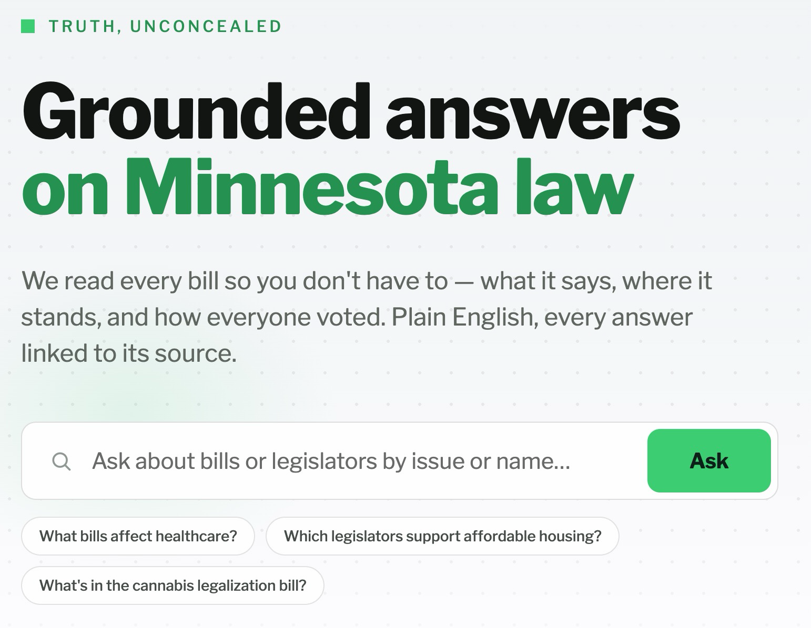

# Grounded Ask — Build Spec

Status: draft for engineering review
Owner: Eugene
Related surfaces: signed-out home (hero), chat

*The mock reflects the **v1** surface: the three chips map 1:1 to the v1 answer paths (bill text · topic → bills · topic → legislators), and the Ask box shows the v1 placeholder copy (§2). The vote chip is **v1.1** — see Phasing in §2.*

## 1. Goal and the promise this build protects

The signed-out home page hero ships this copy:

> **Grounded answers on Minnesota law**
> We read every bill so you don't have to — what it says, where it stands, and how everyone voted. Plain English, every answer linked to its source.

The subhead is a contract, not marketing: **no answer ships without a resolvable citation to its official source.** Everything in this spec exists to keep that sentence true when the hero's Ask box goes from bill-scoped chat to a general question box.

## 2. User-facing behavior

A signed-out visitor types a natural-language question into the hero Ask box. The system classifies the question, answers from ingested Minnesota data with citations, or honestly declines.

The v1 hero placeholder reads **"Ask about bills or legislators by issue or name…"**. The grammar is deliberate: bills and legislators are the only *destinations* the sentence promises; "by issue or name" are *entry points* (issue → the two topic paths; name → a legislator), never a third entity type — v1 has no issue-level answers (no issue pages, no cross-corpus issue summaries). Entry points are ordered by what a layperson actually arrives with: most think in issues or keywords, some know a legislator's name, almost none know a bill's name or number — so bill names are deliberately *not* advertised as an entry point (and "issue" doubles as the keyword case). Deliberately no "votes," a v1.1 capability (see Phasing below). The placeholder must never advertise an intent the router can't answer. Because this copy actively steers users toward arbitrary topics, the retrieval-relevance threshold and NO MATCHES state (§4.5) must ship before it does.

### Acceptance scenarios (the hero's sample chips — these are the tests)

| # | Question | Expected behavior |
|---|----------|-------------------|
| 1 | **What's in the cannabis legalization bill?** *(also handles an HF/SF number, e.g. SF 2310, or a recognizable bill title)* | Resolve to the bill via v1 fuzzy title match, then a bill-text RAG answer using the existing pipeline, with citations to the retrieved passages and the bill's official page. Deliberately phrased without a bill number to prove you don't need one; if the phrase is ambiguous, fall back to the topic → bills list (scenario 2). **One bill per answer:** `bill_text` prose is always scoped to a single resolved bill. Broad cross-bill questions ("what has Minnesota done about housing?") are topic questions — they route to scenario 2, never to a prose answer synthesized across multiple bills (§7, [#87](https://github.com/alethical-org/alethical/issues/87)). |
| 2 | **What bills affect healthcare?** | List of current-session bills matching the topic (policy-area tag and/or keyword match), each with its AI summary line and a citation link to the bill's official page. |
| 3 | **Which legislators support affordable housing?** | Legislators who **authored or co-authored** bills matching the topic, with per-legislator bill counts and links to each legislator profile and the underlying bills. See framing rule in §4.3 — "support" must be reported as authorship/votes, never as inferred opinion. |
| 4 | *Vote question (e.g., "How did my legislator vote on cannabis?")* | **v1: honest deflection** — the router recognizes the intent and answers: vote-by-vote answers are coming soon, and every roll call is already on the bill's page (deep-link the bill's Votes tab when the bill resolves — §9.3). Never a partial or unverified vote answer. **v1.1: the full cited answer** — vote position, tally, date, citation to the roll call's official record; if no roll call exists, say so and offer the chamber tally or bill status. |
| 5 | *Out of scope question (e.g., federal bill, statute lookup, "is this bill good?")* | Polite refusal that names what we do cover. No hallucinated answer. |

Every answer ends with tappable citations using the existing citation panel pattern (excerpt + highlighted passage where applicable + "Open official source").

### Phasing — v1 vs. v1.1

**v1 (launch):** router (§4.1) · bill-text RAG path · topic → bills · topic → legislators · refuse + vote deflection (§4.5) · generalized citation URLs (§4.4) · **bill** resolution only (HF/SF-number regex + fuzzy title match) · Answer page UI states (§9) · Votes tab tally + deep link (§9.3).

**v1.1 (fast follow, gated on the §5 coverage spike):** the `legislator_vote` answer path · person entity-resolution (§4.6) · the "my legislator" location prompt (§8.1) · the vote chip returns to the hero — in chamber-tally form first if individual-vote coverage turns out thin.

Rationale: the vote path stacks the three hardest problems (person resolution, roll-call coverage, signed-out location capture), while every v1 path is a thin formatter over queries that already exist. Roll calls still ship in v1 on the bill page's Votes tab, so the hero's "how everyone voted" stays true product-wide — users can *see* every vote; conversational vote answers arrive in v1.1.

## 3. Already built — do not rebuild

| Capability | Where | Notes |
|---|---|---|
| Bill-scoped RAG chat with citations | `alethical/api/routers/me.py` — `create_chat_message` (~line 440), citation build (~470–481), `synthesize_grounded_answer` (~82–127) | Retrieval over `RagChunk`/`RagChunkEmbedding` scoped by `subject_bill_id`; empty retrieval already falls back to `RAG_CHAT_FALLBACK`. |
| Citation UI (tap → highlighted passage → "Open official source") | `apps/frontend/src/screens/ChatSessionScreen.tsx` (`HighlightedCitationText`, source link ~470–494); `Citation` type in `apps/frontend/src/data/types.ts` | Reuse as-is for the new surface — this panel is what "View in bill" opens (§9.2). |
| Bill query surface with filters | `alethical/api/routers/public.py` — `bills()` (~249), `status_filter_clause` (~164), `/policy-areas` (~216), `/search` (~668) | Chamber, policy area, status, session, omnibus already supported. |
| Legislator-level vote records | `alethical/pipeline/votes.py` — House HTML + Senate PDF roll-call parsing, name matching, writes `VoteEvent` (with `official_url`) + `VoteRecord` | Tally counts parse even when individual name-matching fails; failures logged as `no match`. |
| Per-legislator votes endpoint | `alethical/api/routers/public.py` — `/legislators/{id}/votes` (~549) | |
| Sponsorship data | `alethical/db/models.py` — `Sponsorship` (~401) with `SponsorshipRole` enum (`chief_author` / `co_author` / `sponsor`, ~77); `/legislators/{id}/bills` (~529) | Powers scenario 3, including the authored/co-authored split (§4.2). |
| Representative lookup (address/pin → districts → legislators) | `alethical/api/services/representative_lookup.py`; `POST /representative-lookups` (~595) | Powers "my legislator" once location is known. |
| Ingestion freshness | `alethical/db/models.py` — `IngestionRun` (~484): `finished_at` + `succeeded` status | Powers the "data as of" provenance strip (§9.2): max `finished_at` of succeeded runs. |
| Source URLs per entity | `alethical/db/models.py` — `Bill.official_url` (~322), `VoteEvent.official_url` (~456), `Legislator.profile_url` (~257) | The citation targets for §4.4 already exist on every relevant model. |

## 4. What to build

### 4.1 Question router
Classify each Ask into: `bill_text` (scenario 1) · `topic_bills` (scenario 2) · `topic_legislators` (scenario 3) · `legislator_vote` (scenario 4) · `refuse` (scenario 5). Bounded LLM classification step; low temperature; the router's output is a typed intent, not free text. All five intents are classified in v1 — `legislator_vote` maps to the deflection response (§4.5) until v1.1 ships the real path.

### 4.2 Structured-answer formatters (2–3 thin functions)
Each takes existing query results and produces a plain-English answer **plus a citations array** in the same shape `me.py` already emits (`citation_label`, `excerpt`, `url`, …):
- `topic_bills`: policy-area + keyword match → bill list with AI summary lines; cite each `Bill.official_url`. Return the **total match count** (the UI shows "6 of 23"). Order by **legislative progress** (signed into law → passed chamber → in committee), secondary sort by most recent action date — ordering must be deterministic so a shared `?q=` link re-renders identically. Cap the displayed list at ~6; overflow routes to Search pre-filtered to the topic.
- `topic_legislators`: join topic-matched bills → `Sponsorship` → legislators; cite `Legislator.profile_url` + underlying bills. Displayed counts map from `SponsorshipRole`: `chief_author` → **"Authored"**, `co_author` → **"Co-authored"** (Minnesota Legislature terminology — the UI never says "co-sponsored"). The `sponsor` role and committee-target rows need their semantics confirmed in the §5 spike before they count toward either number. Group by chamber; sort by count descending.
- **(v1.1)** `legislator_vote`: resolve legislator + topic → `VoteRecord` via `/legislators/{id}/votes` join; cite `VoteEvent.official_url`. Fallback ladder: individual vote → chamber tally (VoteEvent counts parse even when names don't match) → bill status.

### 4.3 Framing rule for "support" (scenario 3)
Grounded neutrality: the answer must say what the record shows — "authored or co-authored N bills on affordable housing," "voted yes on HF xxxx" — never "supports affordable housing" as an opinion claim. The word "support" in a user's question is interpreted as *authorship/co-authorship and/or yes-votes* and the answer says so explicitly. On the Answer page this interpretation is **fixed UI copy, not LLM output** (§9.4) — if the model writes the sentence, it will eventually drift; the layout owns it.

### 4.4 Generalized citation source URLs
Today `me.py` hardcodes `url = bill.official_url`. Generalize: citation URL is chosen per source type — bill → `Bill.official_url`, roll call → `VoteEvent.official_url`, legislator → `Legislator.profile_url`. No citation without a resolvable URL.

### 4.5 Cite-or-refuse guardrail (router level)
Extend the existing empty-retrieval fallback into a hard invariant for every answer path:
- Every answer must carry ≥ 1 citation with a resolvable URL, or the system refuses.
- Add a retrieval-relevance threshold so weak matches refuse rather than stretch.
- Out-of-scope classes (federal, statutes, opinion/prediction, open web) refuse with a one-line statement of what Alethical does cover.
- **No-matches (v1):** an in-scope topic with zero (or below-threshold) matching bills gets the **NO MATCHES** response — "No current-session bills match *{topic}*" + Search link + the hero chips. This is a distinct state from out-of-scope refusal (§9.1): in scope, just empty. A zero-result answer has nothing to cite, so it must never render as a normal answer.
- **Vote deflection (v1):** questions classified `legislator_vote` get an honest not-yet — vote-by-vote answers are coming soon, and every roll call is already on the bill's page (deep-link the Votes tab when the bill resolves, §9.3; when the bill doesn't resolve, degrade to the `topic_bills` list with each card linking to its Votes tab). Never a partial or unverified vote answer, and **no tallies or vote positions on the deflection page itself** — those are records and live on the Votes tab.

### 4.6 Entity resolution
**v1 — bills only:** HF/SF-number regex plus fuzzy title match (via `/search`). This is all the v1 paths need — `topic_legislators` reaches legislators through sponsorship joins, not name lookup.

**v1.1 — people:** name/nickname → legislator id, tolerant of partial names and misspellings. `/search` and the name-matching in `votes.py` (`legislator_keys`, `build_legislator_index`) are starting points. "My legislator" resolution depends on §8.1.

### 4.7 Follow-up chips ("Continue the conversation")
Three rules, enforced by construction rather than review:
1. **Route-live-or-don't-ship.** Every chip targets a v1 answer path and must not be refusable — a refusal of a question the system itself suggested is the worst trust failure on the page. `bill_text` chips are derived from the answer's own retrieved/cited chunks (the material is guaranteed present), never free-associated. Cross-intent chips are templates filled from the resolved topic: "What other {topic} bills are there?" (`topic_bills`) · "Which legislators authored {topic} bills?" (`topic_legislators`).
2. **Self-contained submit text.** Signed-out chips fire stateless Asks, so a chip may *display* short text ("Can cities opt out?") but *submits* a fully qualified question ("Can cities opt out under the Adult-Use Cannabis Act (SF 2310)?"). Same mechanism signed-in, so behavior doesn't fork.
3. **Same scope-integrity rule as the placeholder (§2).** No vote-phrased chips until v1.1, nothing opinion-shaped or how-to-shaped. Cap at 3; order deep-dive → bills → legislators.

## 5. Coverage spike — the v1.1 gate (not a v1 launch blocker)

Half-day task against the live DB. Runs in parallel with the v1 build; its findings decide *how* the vote path ships in v1.1:
1. What share of current-session bills with floor action have legislator-level `VoteRecord`s? (Check `no match` log rate from `votes.py`.)
2. Do policy-area tags + keyword search reliably surface bills for: healthcare, affordable housing, cannabis? *(This half is v1-relevant — if a launch chip's topic is weak, tune the keyword backstop before launch.)*
3. *(v1-relevant)* What does the `sponsor` value of `SponsorshipRole` represent in ingested rows (vs `chief_author`/`co_author`), and how common are committee-target sponsorships? Decides whether either counts toward the §4.2 displayed numbers.

**Decision rule:** if individual-vote coverage is thin, the returning vote chip ships in chamber-tally form ("How did the House vote on cannabis?") — still cited, always answerable — and upgrades to individual votes as coverage improves.

## 6. Definition of done

### v1 (launch)
- [ ] The three v1 hero chips (cannabis bill / healthcare / affordable housing) return correct, cited answers against production data.
- [ ] Cite-or-refuse enforced on every answer path — no citation, no answer.
- [ ] Vote questions get the deflection response with a working deep link to the bill's Votes tab — never a partial vote answer, never a tally on the deflection page.
- [ ] Votes tab ships the deflection's landing surface (§9.3): URL-addressable, result + tally inline per roll call, official-record link per row. This is the surface that keeps the hero's "how everyone voted" true — if it can't ship, the hero subhead must be trimmed, not fudged.
- [ ] Citation URLs resolve per source type (bill / legislator), never defaulting to an unrelated bill page.
- [ ] Out-of-scope questions refuse politely with scope statement; in-scope empty topics get the distinct NO MATCHES state (§4.5).
- [ ] "Support" questions use authorship/vote framing per §4.3, rendered as fixed UI copy.
- [ ] Provenance strip (answer scope · status where applicable · "data as of" from `IngestionRun`) renders on every answer state (§9.2).
- [ ] Sign-in from an answer page returns to that exact answer with the clicked action completed — affirmed Track state + auto-dismissing toast, never a generic dashboard (§9.2). Signed-out surfaces never render the affirmed "✓ Tracking" state.
- [ ] `bill_text` follow-up submit navigates to the existing chat screen, seeded with the Ask question + answer as the first exchange (§9.2).
- [ ] Follow-up chips obey §4.7: live-path-only, self-contained submit text, cannot refuse.
- [ ] Placeholder copy matches capability: "Ask about bills or legislators by issue or name…" (no "votes").
- [ ] Existing bill-scoped chat is unchanged (regression: its citations still render and link).
- [ ] Topic-tag half of the coverage spike (§5.2) done for the launch chips' topics; retrieval-relevance threshold tuned before the issue-inviting placeholder ships.

### v1.1 (fast follow)
- [ ] Coverage spike (§5.1) completed; vote-chip form decided (individual vs. chamber tally).
- [ ] `legislator_vote` path live with `VoteEvent.official_url` citations and the §4.2 fallback ladder.
- [ ] Person entity-resolution and "my legislator" location prompt shipped with it.
- [ ] Vote chip restored to the hero; placeholder updated to include votes.

## 7. Out of scope

Federal legislation · Minnesota Statutes corpus · opinion, prediction, or "is this bill good?" analysis · open-web retrieval · multi-model consensus · **cross-bill synthesis** (one prose answer woven from multiple bills' text — [#87](https://github.com/alethical-org/alethical/issues/87); such questions get the cited `topic_bills` list instead). The refusal path names these as not-yet-covered rather than pretending.

## 8. Open questions

1. **(v1.1) "My legislator" on a signed-out page:** trigger the rep-lookup flow inline (address prompt) on first use, or seed the chip with a named legislator until the user runs Find My Legislator / signs in? Leaning: inline prompt reusing `POST /representative-lookups`. Deferred with the vote path — no v1 decision needed.
2. **Answer persistence — v1 decided, v1.1 open.** v1: Copy link/Share emit `?q=` re-run links (topic answers are deterministic DB queries, so re-runs are stable where it matters; `bill_text` prose may vary slightly — acceptable at launch). v1.1+: persist answer snapshots with a public id — the shared URL then shows exactly what the asker saw, and the snapshot log doubles as an audit trail for QA-ing the guardrail. Signed-out sessions still don't persist; sign-in prompt covers save/follow-up.
3. Model/latency budget for the router step (one extra LLM call per question).

## 9. Answer page UI — v1 states

One page template, five states; the router's typed intent decides which renders. All five are mocked in Claude Design (tweak names in backticks). Durable product invariants extracted from this section live in `.claude/rules/grounded-answers.md`.

### 9.1 The states

| State (Design tweak) | Main column | Right rail |
|---|---|---|
| `bill_text` (`bill-text`) | Answer prose with inline numbered citation chips; provenance strip under the H1; Copy link/Share | Sources: excerpt cards (§9.2) + Track roster for the answering bill. Reference implementation for the citation pattern. |
| `topic_bills` (`bills-list`) | Fixed intro line with the **matched topic rendered as a highlighted pill** (makes the router's interpretation visible — keep it); ≤6 bill cards (bill pill · title · status badge · AI summary · View bill → · +Track), ordered per §4.2; "See all N {topic} bills in Search →" overflow; Copy link/Share | None — **each bill card is its own citation**; a Sources rail would duplicate the list. |
| `topic_legislators` (`legislators`) | Fixed framing note (§4.3) directly under the H1; provenance strip; fixed intro line with the **matched topic rendered as a highlighted pill** ("Legislators on the record for {topic}, grouped by chamber:") — same interpreted-topic affordance as `bills-list`, placed as an intro line rather than stacking the header (closed [#85](https://github.com/alethical-org/alethical/issues/85)); legislator rows grouped by chamber (name · party–district · "Authored N · Co-authored M" · View profile →) with an expandable "on the record" strip of the underlying bill pills; "See all N bills in Search →" overflow; Copy link/Share | Slim: most-cited bills as a Track roster. |
| Vote deflection (`vote-deflection`) | ANSWER eyebrow (not an error variant) + COMING SOON badge; honest copy — *"Vote-by-vote answers will land right here. Until then, every roll call on this bill is on its Votes page — each with a link to the official record."*; resolved-bill card; primary CTA "See all votes on {bill} →" deep-linking to the Votes tab (§9.3). **No tallies or positions anywhere on this page.** No Copy/Share — the CTA already routes to the shareable artifact. Unresolved bill → degrade to `topic_bills` with per-card Votes-tab links. | None. |
| Refusal (`out-of-scope`) | Muted OUT OF SCOPE eyebrow (calm, not red); two-sentence scope statement ("…so we won't guess."); "THINGS YOU CAN ASK" + the three hero chips. **NO MATCHES variant** (§4.5): same layout, eyebrow "NO MATCHES," copy names the matched topic as a pill — in scope, just empty; must never share the out-of-scope label. No composer even signed-in — the persistent Ask bar is the retry path. | None. |

### 9.2 Shared elements

- **Provenance strip** under every H1: answer scope ("From bill SF 2310" / "6 of 23 matching bills · 2025–26 session"), bill status where applicable, and "data as of {date}" from the latest succeeded `IngestionRun.finished_at`. Status-aware framing matters: an answer about a bill in committee must read "this bill *proposes*," not "this law *requires*."
- **Citation card anatomy:** section heading · `p.xx` page ref (add the engrossment/version label once a bill has more than one — "p.14" of which version?) · excerpt quote · **"View in bill →"** (green, in-app) opening the existing citation panel from §3 — excerpt highlighted in surrounding text, "Open official source" at the bottom · **`revisor.mn.gov ↗`** (muted, external, new tab) as the one-step path for verifiers. The redundancy is intentional: context-seekers take the panel, skeptics take the shortcut. Visual grammar: green → stays in-app; gray ↗ leaves. Excerpts must cover the claims their chip anchors — one chip per claim.
- **Copy link / Share** on `bill_text`, `topic_bills`, `topic_legislators` only. v1 behavior per §8.2 (`?q=` re-run).
- **Rail bill card.** When the rail shows a **single** bill (`bill_text`'s answering bill, the deflection's resolved bill): bill pill · title · chamber · status · **chief author** ("Chief author: {name} ({party}–{district})", linking to the legislator profile; from `Sponsorship` rows with role `chief_author`) · **signed / last-action date** (from `BillAction`) · a quiet **"See votes →"** link to the bill's Votes tab (the §9.3 `?tab=votes` anchor) · Track button. Rationale: the card puts the product's three promises one click from every answer — what it says (the answer), who made it (author), how everyone voted (votes link). Keep it a card, not a dashboard: those seven elements, nothing more. When a rail lists **multiple** bills (`legislators`' most-cited), cards stay compact — pill · title · chamber · status · Track — the detail lines would double the rail for secondary content. **Track-button states:** signed out is always "+ Track" (tapping starts sign-in — the affirmed state can never render signed-out); the affirmed label is **"✓ Tracking"** (one verb everywhere), signed-in only.
- **Auth states:** signed-out shows the sign-in card and chips fire fresh stateless Asks; signed-in swaps the card for the follow-up composer. Follow-up scoping: on `bill_text` answers the composer continues in the existing bill-scoped chat; on topic answers there is no bill to scope a thread to, so the composer submits a **new routed Ask** (navigates to a fresh answer page).
- **Returning from sign-in:** authenticating from an answer page always returns to that exact answer (the `?q=` re-run) with the clicked intent already completed — the Track button affirmed ("✓ Tracking"), a toast confirming it ("Now tracking SF 2310.", auto-dismissing after ~3 seconds; the affirmed button is the durable confirmation), and the composer unlocked. Never a generic dashboard, and never make the user redo the click that sent them to auth.
- **Follow-up transition on `bill_text` (decided Jul 2026):** submitting the composer **navigates to the existing chat screen**, with the session seeded by the Ask question + generated answer as its first exchange so the thread stands alone. Copy link on the answer page keeps its `?q=` semantics untouched. Rendering the thread on the answer page itself (morph in place) is the tracked upgrade — [#137](https://github.com/alethical-org/alethical/issues/137); it stacks a new hybrid view on an unresolved question (shareable `?q=` URL vs. private stateful thread), so it waits for a spike + usage signal.
- **Deterministic rendering:** anywhere a `?q=` link can re-render (ordering, truncation), the rules in §4.2 apply — no nondeterministic ordering.

### 9.3 The Votes tab dependency (`votes-tab` — ships with v1)

The deflection CTA and the hero's "how everyone voted" both land here:
- **URL-addressable tab** (`?tab=votes` or `#votes`). The deflection CTA is cross-page navigation and can only target a tab that exists in the URL, not component state. The same anchor is what v1.1 roll-call citations will deep-link to, and it gives users shareable vote URLs for free.
- Each roll-call row: motion/reading · date · chamber · **result with tally inline** ("Passed · 70–58") · "View roll call →" to `VoteEvent.official_url`.
- This is a **records surface**, not a generated answer: tallies belong here and must not appear in generated answers before v1.1 ships the cited vote path.

### 9.4 Fixed-copy elements (layout-owned, never LLM-generated)

- The §4.3 framing note on `topic_legislators`: *"'Support' shown as what the public record shows: bills authored or co-authored on this topic — not inferred opinions."*
- The `topic_bills` intro line template ("Current-session bills matching {topic}, by legislative progress:").
- The `topic_legislators` intro line template ("Legislators on the record for {topic}, grouped by chamber:").
- Refusal and NO MATCHES body copy.
- The deflection paragraph (§9.1 wording — do not strengthen it to "every member, every vote" unless the Votes tab renders member-level breakdowns in-app).

## 10. Roadmap notes — deferred upgrades (non-blocking)

Upgrades identified during design that v1 deliberately ships without. Each is **filed as a GitHub issue** (per CONTRIBUTING.md: an open issue means "still needs doing"; monthly triage closes what shipped) — the issue is the durable home; this table records the reasoning at the time of deferral. #81–84 and #137 are on the `v1.1` milestone; #85 has shipped. (#87's phasing needs reconciling — its issue is milestoned `v1.1`, but §7 and its row below frame it as post-v1.1.)

| Upgrade | Issue | Today (v1) | Why deferred / what unblocks it |
|---|---|---|---|
| **Passage-anchor deep links** — "View in bill" navigates to the full bill page scrolled to the highlighted passage | [#81](https://github.com/alethical-org/alethical/issues/81) | Opens the existing citation panel (§9.2) — already built, zero new work | Requires passage anchors to be URL-addressable — same class of work as `?tab=votes` (§9.3; rule 5 in `.claude/rules/grounded-answers.md`). Natural pairing: build it when the v1.1 vote path adds roll-call citations, which need the same anchor plumbing. |
| **Answer snapshots** — Copy link/Share serve a persisted answer with a public id | [#82](https://github.com/alethical-org/alethical/issues/82) | `?q=` re-run links (§8.2) | Needs snapshot storage + retention decisions. Payoff beyond sharing: an audit trail of every answer given, for QA-ing the cite-or-refuse guardrail. |
| **Member-level roll-call rendering in-app** — Votes tab shows every member's vote, not just tally + official link | [#83](https://github.com/alethical-org/alethical/issues/83) | Tally inline + "View roll call →" to the official record | Gated on §5.1 name-match coverage. Unlocks the stronger deflection copy ("every member, every vote," §9.4) and richer v1.1 vote answers. |
| **Follow-up threading on topic answers** — signed-in composer continues a general Ask thread | [#84](https://github.com/alethical-org/alethical/issues/84) | Composer submits a new routed Ask; only `bill_text` answers thread (into existing bill-scoped chat, §9.2) | Needs a chat-session model not scoped to `subject_bill_id`. Revisit when Ask usage shows multi-turn topic exploration. |
| **Follow-up thread rendered on the answer page** — the `bill_text` answer morphs into the thread in place | [#137](https://github.com/alethical-org/alethical/issues/137) | Submitting navigates to the existing chat screen, seeded with the question + answer (§9.2) | New hybrid view + Design frame, and an unresolved question: the shareable `?q=` URL vs. a private stateful thread — spike that first. Revisit on `bill_text` follow-up usage. Sibling: #84. |
| ~~**Matched-topic pill on `legislators`**~~ — **landed** (Jul 8, 2026) | [#85](https://github.com/alethical-org/alethical/issues/85) (closed) | Design placed it as a fixed intro line ("Legislators on the record for {topic}, grouped by chamber:"), avoiding the header-stacking concern; ships with the v1 build (#79, §9.1) | Was: pure design pass with the next visual iteration — which is exactly how it resolved. |
| **Cross-bill synthesis** — one prose answer woven from multiple bills, per-bill citation pills, "From bills X and Y" provenance | [#87](https://github.com/alethical-org/alethical/issues/87) | `bill_text` is single-bill; broad cross-bill questions route to `topic_bills` (§2 scenario 1) | Cross-bill retrieval unbuilt; synthesis across bills raises hallucination + per-claim citation-coverage risk; §4.5 thresholds are per-bill. Design already mocked (Claude Design `bill-text` → "Multiple bills" variant) — reuse when built. Post-v1.1. |
