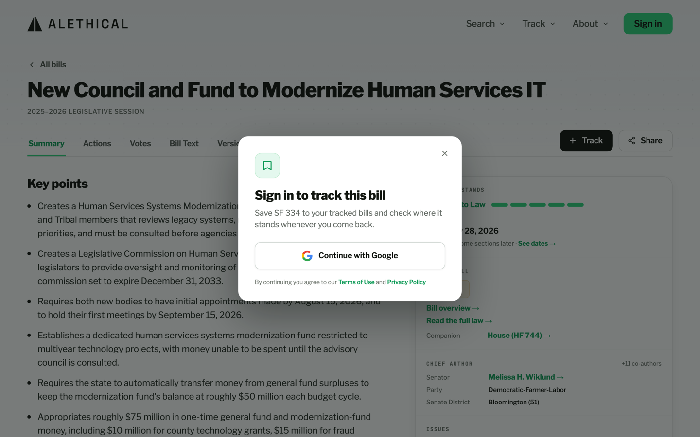
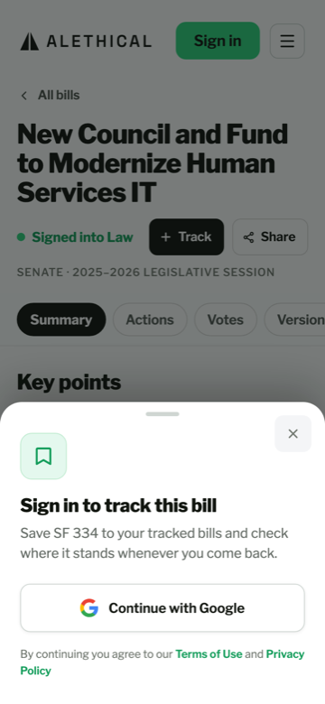

# Sign-in — build notes (repo context)

Companion to `README.md` (the design handoff, verbatim from Claude Design) and
`sign-in.dc.html` (the literal-values reference — NOT markup to port; React Native can't
render HTML/CSS).

## Provenance
Handoff from Claude Design, Aug 5 2026. Built and shipped by
[#1006](https://github.com/alethical-org/alethical/issues/1006).

## What shipped
Captured from the running app against the production API, both surfaces showing the
track intent (`shipped/`).

| Web — centered overlay | Phone — bottom sheet |
| --- | --- |
|  |  |

## Where it lives in the app
- `apps/frontend/src/lib/signIn.ts` — the copy config and the state machine, as plain data
  so a test can read them (`src/lib/__tests__/signIn.test.ts`).
- `apps/frontend/src/components/auth/SignInDialog.tsx` — one component, centered card on a
  desktop-width browser and bottom sheet on a phone.
- `apps/frontend/src/components/auth/AccountControl.tsx` — the three signed-in placements.
- `apps/frontend/src/providers/SignInModalProvider.tsx` — mounts exactly one dialog and
  exposes `openSignIn({ intent, returnTo, billCode })`.

## Deviations from the reference, and why
- **The track icon is a bookmark, not the reference's bell.** A bell reads as "we will
  notify you", and sending is not built ([#36](https://github.com/alethical-org/alethical/issues/36)) —
  the server records that an alert is due and sends nothing. `.claude/rules/grounded-answers.md`
  rule 6 forbids claiming it, and an icon makes the claim as surely as a sentence does. A
  bookmark states the payoff we do deliver: a saved list.
- **The "Already signed in" panel is not built.** The reference itself prefers proceeding
  without showing it ("ideally just proceed without showing the modal"), so `openSignIn`
  is a no-op when a session already exists, and the dialog closes on its own if a session
  appears in another tab. Nothing can reach the panel, so nothing renders it.
- **The sheet's "Waiting for Google…" panel is not built**, per the reference's own note:
  phone web uses the same full-page redirect as desktop, so both surfaces get the button
  spinner. The panel is a native-app variant we have no native app for.
- **The centered card starts at 768px wide, not at the app's 1100px "desktop" break.** A
  tablet gets the card; only phone widths get the sheet. The reference names the two
  surfaces "web" and "mobile" without a pixel, and a 900px window reads wrong as a sheet.
- **The Terms and Privacy links point at our own in-app pages** (`/terms`, `/privacy`) on
  web rather than the reference's absolute `alethical.com` URLs, so they work in a local
  or preview build. They still open in a new tab, so the dialog is not lost behind them.
  Native has no anchor, so it opens the absolute URL instead.
- **The error text is the token ramp's darker red (`dangerRamp.r800`)**, not the
  reference's `#8f2a20`, so small text on the pink banner clears WCAG AA
  (`docs/design/design-principles.md` §3, accessibility overrides the spec).
- **With reduced motion on, the connecting button reads "Connecting…"** instead of showing
  a spinner. The reference says suppress the spinner; a blank button would leave nothing
  in its place.
- **No `assets/google-g.png`.** The reference loads the Google mark as an image; the app
  already draws it as an inline SVG (`GoogleG` in `theme/primitives.tsx`), so the asset
  was never copied.

## Deliberate absence, carried over from the reference
There is **no trust line** ("We only save the bills you track. Nothing else."). One caption
sits under the button — "By continuing you agree to our Terms of Use and Privacy Policy",
with no terminal period. The `trust` strings are still in the reference's intent config and
are deliberately left unrendered: the subcopy already says what is saved, and Google's own
consent screen names what we receive before anyone can finish.

## Configured but not wired
The **legislator-votes** intent is in `SIGN_IN_INTENTS` with `live: false`, and
`openSignIn` refuses it. Nothing saves a person's district — not to the account, not to the
device, not in memory — and the columns set aside for it are dead. Owned by
[#456](https://github.com/alethical-org/alethical/issues/456). It stays in the config so
that work adds an entry rather than a second sign-in box.
