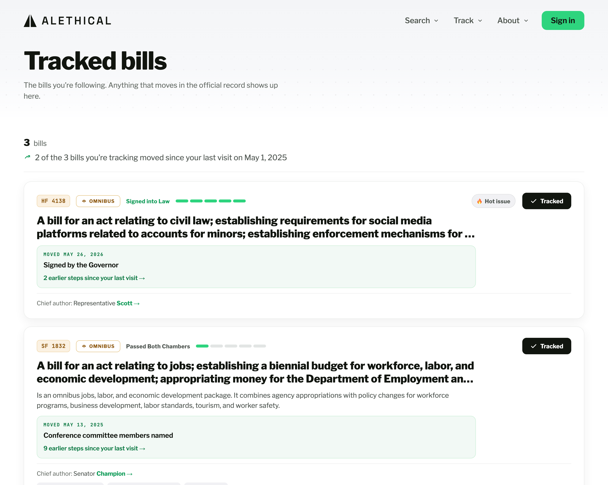
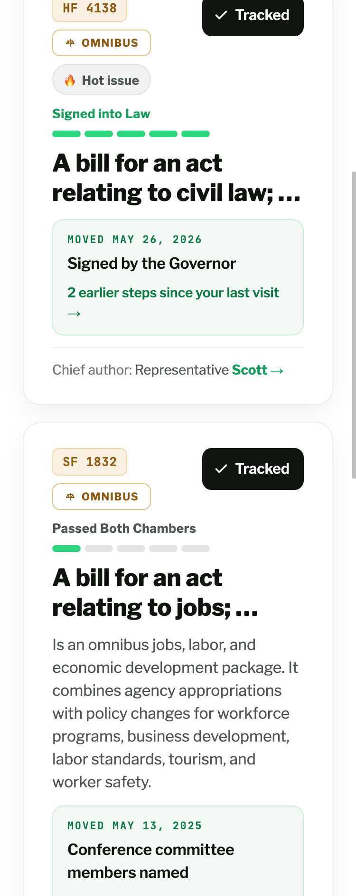
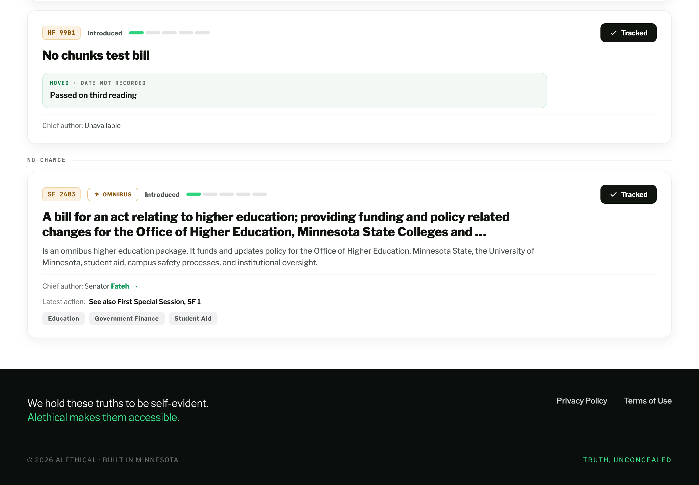

# Mockup: Tracked bills — "what changed since you last looked"

The design reference this page was built from ([#1009](https://github.com/alethical-org/alethical/issues/1009),
shipped in [#1010](https://github.com/alethical-org/alethical/pull/1010)). Kept here as the
record of what was asked for, so a later change can tell a deliberate difference from a drift.

## Files

- `tracked-bills-changed.dc.html` — the design reference: the web page, the phone layout
  beneath it, and four states in its preview band (**Bills moved · Nothing moved · First
  visit · Nothing tracked**). Authored in HTML as a Design Component; it is a reference, not
  production code. `<sc-for>` / `<sc-if>` are loop / conditional and `{{ … }}` is a data
  binding.
- `HANDOFF.md` — the designer's own notes: the decisions, the declined items, and the exact
  colours and sizes.

**The bills, dates, statuses and change sentences in the reference are placeholder.** They
were never reconciled against the real corpus and must not be. Only the layout, the states,
the treatment, the ordering rules and the copy are authoritative.

## What shipped

All three captured from the running app against the local seeded database. The third is the
two states added in round 3, in one shot and in the same list as dated blocks: the eyebrow
names the absence, and the change block takes 20px below the title where the summary would
otherwise sit. Measured on that card: `MOVED` is `#0f7a45`, `· DATE NOT RECORDED` is
`#656c66`, both on one line in the same mono caps, and the title-to-panel gap is 20px
against 72px on the card above it that has a summary.

The phone shot is the
crowded case the design calls out: HF 4138 carries the code badge, the OMNIBUS tag and the
hot-issue pill, which wrap inside their own group while the Track button holds the right
edge — the same spot it holds on SF 1832 below it, which carries one label. Measured at
375px, the button's right edge is at 320px with zero, one and two labels.

## What the built page does differently, and why

Every difference from the reference, so nobody has to guess whether one was intended.

- **One claim in `HANDOFF.md` is factually wrong: "on phone this case is invisible — the
  phone card never rendered a summary line".** It does, and always has. In
  `apps/frontend/src/components/search/BillResultCard.tsx` the `isMobile ? (…) : (…)`
  branch covers the **header only** and closes before the title; the title and the summary
  are rendered once, outside it, by both layouts. Committed proof at 375px:
  `docs/verification/1007-tracked-bills-phone/tracked-page-375px.png`, where two bills show
  a full summary paragraph and the unenriched one shows none. So the no-summary composition
  is **not** web-only and the 20px treatment is applied on both surfaces. Flagged so the
  reference can be corrected; the bundle itself is left as the designer wrote it.
- **The earlier-steps link counts every classified change, not only the big ones.** The
  issue asked for "meaningful milestones". Counting only milestones makes the link disappear
  on a busy day — the exact day it exists for — and understates what happened. It counts the
  entries the shared timeline produces after it collapses an author run, a floor-passage
  cluster and the repeated signing rows into one each, so a seven-row day reads as the four
  things that happened. Pointers to other bills ("See also HF 2446") are left out: they are
  not steps this bill took.
- **The mono eyebrow and the earlier-steps link are `#0f7a45`, not the reference's
  `#149d5b`.** At 11px and 14px on the panel's green, `#149d5b` measures 3.27:1 — short of
  WCAG AA's 4.5:1 for small text. `#0f7a45` measures 5.05:1. The same call, for the same
  reason, as the omnibus token's own note in `apps/frontend/src/theme/tokens.ts`.
- **"· DATE NOT RECORDED" is `#656c66`, not the reference's `#6f756f`,** for the same
  reason: at 11px the reference grey measures 4.41:1 on the panel, just under AA, and
  `#656c66` (the existing `text.muted` token) measures 5.05:1 — the same figure as the green
  beside it, so neither half of the eyebrow dominates the other.
- **The panel uses the existing green tokens** (`tint.t50` `#f2f9f5`, `tint.t300` `#cbeed6`)
  rather than the reference's `#f2fbf6` / `#cdeedd`. The pairs are visually identical, and a
  near-duplicate palette entry is a thing that later drifts.
- **The count row has no "in the 2025–2026 Legislative Session" sub-label.** A watchlist can
  hold bills from more than one session, so one session name under a mixed list would be
  false — and the tracked-bills route does not serve each bill's session, so it cannot be
  checked. Dropped rather than asserted.
- **Dates carry the year** ("Mar 12, 2026", not "Mar 12"). This is a page people return to
  months apart.
