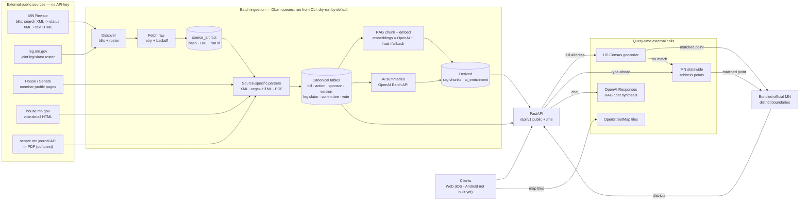

# Data Ingestion — Full-Stack Onboarding Guide

<!-- describes: alethical/pipeline/*.py, alethical/db/models.py, alethical/api/routers/me.py, alethical/api/services/representative_lookup.py -->

> Practical map of every data source Alethical pulls from, how each is fetched
> and parsed, how the pipeline is orchestrated, and what you need installed.
> Verified against the code on 2026-07-03. Companion design docs:
> [layer-1-source-ingestion-system-design.md](../architecture/layer-1-source-ingestion-system-design.md),
> [layer-2-rag-ingestion-system-design.md](../architecture/layer-2-rag-ingestion-system-design.md),
> [db-schema-system-design.md](../architecture/db-schema-system-design.md).

## TL;DR mental model

Alethical ingests **Minnesota legislative data by scraping official public
government sources** — there is no single vendor API and **no API keys are
needed for any government source**. Bills come from the MN Revisor (XML + HTML),
legislators from the joint Legislature roster + chamber profile pages, votes from
chamber-specific journals/pages, and district lookup from US Census + Minnesota address
points + local copies of official MN GIS boundaries. There are **two** credentialed dependencies: **Anthropic**
(`alethical/pipeline/anthropic_enrichment.py` — where every production bill summary
comes from today) and **OpenAI** (the batch summary backend + RAG chat). This guide
named only OpenAI, which pointed a new engineer at the wrong one. Since #1328 a third
credential exists, and it is a different kind: campaign finance needs **no key to
fetch** and Storage credentials to **keep** what it fetched, because the Board keeps
no archive and our copy is the only record of what it published on a given date
(section **H**).
Everything is orchestrated through an **Oban (Postgres-backed) job queue driven
from a CLI** — **nothing ingests on a schedule; a human runs the pipeline**. All
batch ingestion is **dry-run by default** and **idempotent**. Scheduled jobs do
exist beside it (`.github/workflows/`) and **none of them ingests**: they check for
gaps a human run left behind, and one copies stored files to a second place
(section **H**).

Code: [`alethical/pipeline/`](../../alethical/pipeline) (batch) ·
[`alethical/api/`](../../alethical/api) (query-time) ·
[`scripts/`](../../scripts) (one-shot loaders). Config: [`.env.example`](../../.env.example).

## Pipeline flow (one page)



RAG embeddings use OpenAI `text-embedding-3-small` when `OPENAI_API_KEY` is set;
offline (tests / no key) they fall back to a deterministic SHA-256 hash — see the
**E & F — OpenAI** section. All flows are functional.

> Downloadable version of this diagram (for slides / offline):
> [SVG](../architecture/layers-1-2-ingestion-pipeline.svg).

## The two ingestion layers (and where the design depth lives)

The flow above spans **two ingestion pipelines**, and this guide is weighted toward the
first. Each has its own design doc; read those for the "why" and the quality bars this
operational guide doesn't repeat.

- **Layer 1 — source ingestion** (official sources → canonical records). Everything below
  in this guide — the source map, the per-source fetch/parse sections, roster
  reconciliation, orchestration, and provenance — is layer 1. Design doc:
  [`layer-1-source-ingestion-system-design.md`](../architecture/layer-1-source-ingestion-system-design.md)
  (the seven pipeline stages, source-authority split, and enrichment status).

- **Layer 2 — RAG ingestion** (canonical records → retrieval chunks for chat). Layer 2
  consumes layer 1's canonical bill text and turns it into cleaned, citation-safe chunks
  with embeddings. This guide covers only its operational edges — section-based chunking
  (~220-word target), `text-embedding-3-small` with a hash fallback (see **E & F —
  OpenAI**), the `bill-sync-chunk` worker, and `backfill_rag_bulk.py`. The parts it does
  **not** cover — the cleaning transforms (amendment-marker rewriting, whitespace/table
  normalization), the fidelity/cleanliness/legibility quality gates, the validation report,
  and the HNSW retrieval index — live in
  [`layer-2-rag-ingestion-system-design.md`](../architecture/layer-2-rag-ingestion-system-design.md).

Two adjacent AI uses are **not** layer 2 and are easy to conflate with it: **AI enrichment**
(bill summaries → `ai_enrichment`, section E) is a separate derivation from canonical data,
and **RAG chat synthesis** (section F) is query-time retrieval, not ingestion. Layer 2 is
specifically the ingestion that _builds the retrieval corpus_ those depend on.

## The source map

| #   | Domain                                   | Source                                                                                 | Protocol / Format                          | Auth             | Code                                                                                                                                 |
| --- | ---------------------------------------- | -------------------------------------------------------------------------------------- | ------------------------------------------ | ---------------- | ------------------------------------------------------------------------------------------------------------------------------------ |
| A   | Bills, actions, sponsors, versions, text | MN Revisor                                                                             | HTTP `GET`, XML + HTML                     | none             | [minnesota.py](../../alethical/pipeline/minnesota.py)                                                                                |
| B   | Legislator roster & profiles, committees | Joint directory + House/Senate member pages                                            | HTTP `GET`, HTML (regex)                   | none             | [minnesota.py](../../alethical/pipeline/minnesota.py), [committee_memberships.py](../../alethical/pipeline/committee_memberships.py) |
| C   | Roll-call votes                          | House vote pages + Senate journal API→PDF                                              | HTTP `GET`, HTML + JSON + PDF              | none             | [votes.py](../../alethical/pipeline/votes.py)                                                                                        |
| D   | District lookup (Find My Legislator)     | US Census geocoder + MN statewide address points + bundled official LCC-GIS boundaries | HTTP `GET` JSON + local compressed GeoJSON | none             | [representative_lookup.py](../../alethical/api/services/representative_lookup.py)                                                    |
| E   | AI bill summaries                        | OpenAI Batch API                                                                       | HTTPS, JSON                                | `OPENAI_API_KEY` | [ai_enrichment.py](../../alethical/pipeline/ai_enrichment.py)                                                                        |
| F   | RAG chat synthesis                       | OpenAI Responses API                                                                   | HTTPS `POST`, JSON                         | `OPENAI_API_KEY` | [me.py](../../alethical/api/routers/me.py)                                                                                           |
| G   | Map tiles                                | OpenStreetMap                                                                          | HTTP tiles                                 | none             | frontend `MapPinPicker.tsx`                                                                                                          |
| H   | Campaign finance (money in and out)      | MN Campaign Finance Board data downloads                                               | HTTP `GET`, 3 whole CSV files              | none to fetch; storage credentials to keep the files | [campaign_finance.py](../../alethical/pipeline/campaign_finance.py), [raw_file_store.py](../../alethical/pipeline/raw_file_store.py) |
| H2  | What each committee itself reported, and Minnesota's registered-filer list | MN Campaign Finance Board per-filer services (undocumented) | HTTP `POST`, JSON — and money inside an HTML table inside JSON | none to fetch; storage credentials to keep the responses | [campaign_finance_filings.py](../../alethical/pipeline/campaign_finance_filings.py) |

**Every one of those `GET`s decodes through one helper, and it has to**
([http_text.py](../../alethical/pipeline/http_text.py)). Sources A, B and C each
have their own retrying fetch function, and each used to finish with
`return response.text`. That is a trap: `requests` takes the character set from the
`Content-Type` header, and when a `text/*` response names none it falls back to
ISO-8859-1 (RFC 2616 §3.7.1). Three of the pages we read send exactly that while
their bytes are UTF-8 — the Revisor's bill-status API (`text/xml`, whose XML even
_declares_ `encoding="UTF-8"` in a declaration that is thrown away once the body is
a decoded string), the Senate's member pages, and the Senate's journal index. Under
the fallback every UTF-8 byte became its own Latin-1 character, so Rep. María Isa
Pérez-Vega's name entered the pipeline as `Pérez-Vega` and reached 42 bills' author
rows, 2 bill descriptions and 1 office address that way
([#849](https://github.com/alethical-org/alethical/issues/849)). `response_text`
believes a stated charset, tries UTF-8 when none is stated, and keeps the RFC
fallback as the net for a source that really is Latin-1. **A new fetcher calls it
rather than `response.text`** — that one line is the whole defect, and a fifth
scraper written later should inherit the fix, not the bug.

**Timeframe scope:** the **94th Legislature (2025-2026)** — its regular session
(`session_code="0942025"` / `"0942026"`, session `94-2025-regular`, `bill_key`
`94-2025-{FILETYPE}{NUMBER}`, e.g. `94-2025-HF2136`) and its **2025 first special
session** (`session_code="1942025"`, session `94-2025-special-1`, `bill_key`
`94-2025s1-{FILETYPE}{NUMBER}`). The `s1` is load-bearing: a special session numbers
its files from 1 again, so `HF 5` exists in both and they are different bills (#746).
Which row a discovery code ingests into is declared in `SESSION_DEFINITIONS`
([sessions.py](../../alethical/pipeline/sessions.py)); an unmapped code raises rather
than defaulting into the current biennium. Supporting other biennia means adding
their definitions ([#359](https://github.com/alethical-org/alethical/issues/359)).

## A — Bills (MN Revisor)

The backbone. Three sequential fetches per bill through a retrying
`requests.Session` (User-Agent `Alethical Minnesota Ingest/0.1`, 30s timeout, 3
retries with linear backoff on `429/500/502/503/504`).

1. **Discovery / search** —
   `GET https://www.revisor.mn.gov/bills/status_result.php?body=House&search=basic&session=0942025&location=House&bill=2136&bill_type=bill&submit_bill=GO&keyword_type=all&format=xml`
   → `<BILL_RESULT>` XML (parsed with `ElementTree`) exposing `FILE_TYPE`,
   `FILE_NUMBER`, `DESCRIPTION`, and two discovered URIs: `STATUS_XML_URI` and
   `LATEST_TEXT_HTML_URI`. Full-session discovery walks bill numbers 1→6000 in
   chunks of 500 across both chambers.
2. **Bill status XML** (`STATUS_XML_URI`) → actions, authors/sponsors, companion
   bill, version inventory. Canonical spine for `bill`, `bill_action`,
   `sponsorship`, `bill_version`.
3. **Bill text HTML** (`LATEST_TEXT_HTML_URI`) → section headings + text via
   balanced-`<div>` regex parsing (no HTML library) → `bill_version_section` and
   the RAG chunker.

Reference URL shapes: `https://api.revisor.mn.gov/bills/v1/94/2025/0/HF/2136/` ·
`https://www.revisor.mn.gov/bills/94/2025/0/HF/2136/versions/0/`

### A bill's current status keeps the 2 chamber counters separate

House action 20 is not automatically newer than Senate action 7. Each chamber starts its own
counter at 1, so the importer orders action numbers only inside that chamber
([#1322](https://github.com/alethical-org/alethical/issues/1322)). It then compares the last House
and Senate actions by date. An undated action after dated actions carries the chamber's preceding
date for this comparison only; its stored `action_at` stays empty. If both chamber tails land on the
same date, their order in the official status XML is the stable fallback.

An enactment or veto is a terminal milestone. A later routine label cannot make an enacted bill
look pending again. `latest_action_at` still records only the latest real date supplied by the
state. The release dry run found 163 stored current-status labels that the bounded correction will
cover under this rule.

### Re-fetches refuse 1 thin source response

Before an existing bill is changed, the importer compares the fetched counts of
actions, authors, text versions and sections with the last accepted response
([#1319](https://github.com/alethical-org/alethical/issues/1319)). A lower count
does not change any bill fact. It immediately fetches all 3 official responses again:

- a complete second fetch replaces the first one;
- the same lower facts twice corroborate a real source removal and may be saved;
- a failed or differently thin second fetch marks that bill's run failed and adds
  `bill_refresh_rejections[].needs_issue=true` to the chunk result;
- the chunk continues with its other bills, so 1 rejected bill does not undo up
  to 24 successful ones.

The future scheduled refresh
([#1323](https://github.com/alethical-org/alethical/issues/1323)) owns turning that
post-retry signal into a GitHub issue. A blank description is non-destructive: it
keeps the stored description, just as a blank parsed title keeps the stored title.

A twice-confirmed lower section list reconciles only the accepted current version
([#1423](https://github.com/alethical-org/alethical/issues/1423)). Positions absent from that
version are removed while every historical version remains unchanged. Because the database links
do not delete dependents automatically, the importer explicitly removes each absent section's
embedding, chunk and search-document rows before its canonical row. All of those writes share the
bill refresh transaction, so a later search-build failure restores the old canonical and search
rows together.

### Changed bill text and search rows publish together

An accepted batch reports every canonical write in `bill_keys` and only new or changed
public text in `text_changed_bill_keys`
([#1320](https://github.com/alethical-org/alethical/issues/1320)). The change signal is the
current `bill_version.id` plus the ordered SHA-256 hashes of each stored
`bill_version_section.raw_text`. A metadata-only refresh therefore does not pay to rebuild search,
while a new version or changed section wording does.

`bill-sync-chunk` flushes the accepted bill rows, builds retrieval rows only for that changed
subset through the same database session, then commits once. A chunking or embedding failure rolls
back the bill refresh too, so the retry cannot mistake unindexed new text for an unchanged bill.
The worker refuses inline writes to a different RAG database because that second connection could
publish only half of the refresh.

For every bill in `text_changed_bill_keys`, the same transaction marks its displayed
`bill_summary` non-current, and the database clears both `Bill.has_current_summary`
([#1321](https://github.com/alethical-org/alethical/issues/1321)) and `Bill.short_title`, the copy
of that summary's plain-language headline that keyword search matches (alembic 0033). The product
therefore shows the new official record without a summary rather than pairing it with an older
draft's explanation, and search stops matching a headline the bill no longer displays.
Metadata-only updates and rejected thin responses keep the summary that still matches. This step
does not call a model or spend money; a later missing-current batch may choose the bill for a new
summary. Refresh and summary apply take the same bill-row lock, so a result prepared from old text
cannot pass its check during a refresh and become current after that refresh commits.

### A section's body is stored twice, and that is deliberate

`bill_version_section` holds each section's body in two columns, written together
by `parse_bill_section`:

- **`raw_text`** — the flat string, produced by stripping every tag. It loses the
  subdivision numbers ("Subd. 2."), the marks saying which words the bill _adds_,
  and the row/column shape of appropriation tables.
- **`body_blocks`** (JSON) — the same body as an ordered list of blocks that keeps
  all three: `{"kind": "heading", "number": "Subd. 3.", "text": "Health plan."}`,
  `{"kind": "para", "text": …}`, `{"kind": "table", "rows": [[cell, …], …]}`. Built
  by `parse_section_blocks`. Null on any section stored before that existed, so
  every reader must fall back to `raw_text`.

**Never "fix" `raw_text` to carry the structure instead.** Two paid caches hash it,
and rewriting it re-runs both corpus-wide jobs:

| cache                                | where it hashes `raw_text`                                                                                          | what a rewrite costs                            |
| ------------------------------------ | ------------------------------------------------------------------------------------------------------------------- | ----------------------------------------------- |
| every section's search embedding     | `rag_ingest.py` — `source_hash(section.raw_text)`; a mismatch re-chunks and re-embeds                               | paid re-embed of the whole corpus               |
| every bill's AI summary + key points | `ai_enrichment.py` folds the same hash into `source_version_hash`; `should_enqueue` re-runs a bill whose hash moved | paid re-run of the full ~10,400-bill enrichment |

Nothing hashes `body_blocks`, so filling it in is free. That is why the structure
lives in its own column and why the free backfill
(`scripts/backfill_bill_section_body_blocks.py`) writes **only** that column —
never `raw_text`, not even with the same value. Decided while fixing
[#741](https://github.com/alethical-org/alethical/issues/741) and
[#752](https://github.com/alethical-org/alethical/issues/752). A fresh ingest fills
the column itself, so only bills stored before that landed need the backfill.

**`bill_version_section.updated_at` is useless for dating a text change, and
2026-07-30 is why.** That backfill ran corpus-wide on 30 July 2026 and wrote
`body_blocks` on all 46,063 sections of every current version. `TimestampMixin`
bumps `updated_at` on any update, so **every section in the corpus carries that
date** while its `raw_text` was not touched at all. Anyone tracing who last changed
a section's text by timestamp will be misled into thinking the whole corpus was
rewritten that day. To date a _text_ change, compare `raw_text` against its hash
(`source_hash` on the row, or the search document's `source_hash`) — a row whose
stored hash no longer matches its text has had its text rewritten, whatever the
timestamp says. Two sections were found in exactly that state, both from the
duplicate-id data loss in
[#763](https://github.com/alethical-org/alethical/issues/763).

One trap in that comparison: `bill_version_section.source_hash` holds **either** the
full 64-character sha256 (`content_hash` in `alethical/pipeline/minnesota.py`) **or**
its 16-character prefix (`source_hash` in `alethical/pipeline/rag.py`), depending on
which writer last touched the row. Comparing against only one form reported 2,287
false mismatches out of 3,000 — which reads exactly like the corpus-wide disaster
this section exists to prevent.

## B — Legislators, profiles, committees

- **Roster (discovery):** `GET https://www.leg.mn.gov/leg/legislators` →
  regex-parsed into House + Senate members (name, district, profile URL, image).
  Sanity check: **134 House + 67 Senate seats** (the scrape lists seats, so a
  mid-biennium vacancy may still appear here).
- **House profile:** `https://www.house.mn.gov/members/profile/{id}` → party,
  district, office block, `@house.mn.gov` email, `651-` phone, committees.
- **Senate profile:** `http://www.senate.leg.state.mn.us/members/member_bio.php?leg_id={id}`
  → **separate adapter** (the HTML differs).
- **Committee memberships** are scraped from those same profile pages; a
  legislator with zero committees is valid (`committee_count = 0`).
- **Membership reconciliation (canonical PDF):** the HTML scrape only ever
  _adds/updates_ members, so a member who leaves mid-biennium lingers as
  `is_current`. The official printable roster PDF
  (`https://www.house.mn.gov/hinfo/leginfo/memroster.pdf`, linked as the "All
  Members Roster" from both `senate.mn` and `house.mn.gov`) is the canonical
  authority for **who currently holds each seat**. `reconcile_current_members`
  ([roster_pdf.py](../../alethical/pipeline/roster_pdf.py) +
  [minnesota.py](../../alethical/pipeline/minnesota.py)) parses it and sets
  `is_current = False` on any current member the PDF no longer lists (vacated,
  or the seat is now held by someone else). Rows are never deleted. Run it via
  `just reconcile-roster` (dry-run) / `just reconcile-roster apply=true`, or
  `scripts/load_minnesota_data.py --reconcile-only [--dry-run]`; the normal
  roster load also runs it when passed `--reconcile-roster`. **Re-run at each new
  biennium (~every 2 years, against the new `--session-slug`) and whenever a
  member leaves mid-session.** Spec:
  [legislator-roster-canonical-membership-spec.md](../architecture/legislator-roster-canonical-membership-spec.md).

## C — Roll-call votes (chamber-specific)

Revisor gives roll-call _totals_ (e.g. `34-33`) but not individual legislators, so
votes need dedicated adapters (User-Agent `Alethical Vote Backfill/0.1`):

- **House:** `GET https://www.house.mn.gov/votes/Details?...` (HTML) → parses
  `"N YEA and M Nay"` plus affirmative/negative name tables.
- **Senate:** two hops —
  1. `GET https://www.senate.mn/api/journal/gotopage?page={p}&ls=94` → JSON with
     `fileBiennium`, `filename`, `internal_page`.
  2. Download `https://www.senate.mn/journals/{biennium}/{filename}.pdf`, extract
     text with the **`pdftotext` CLI** (poppler — a system dependency), then
     regex-parse names.

Votes are **optional** — a bill legitimately has zero vote events if there was no
recorded roll call or the source can't be matched deterministically.

The daily job still fills only missing roll calls. Saved roll calls use a separate correction
path: an accepted changed bill action rechecks that exact bill, and a small rotating sample catches
official corrections made without a bill-action change. The correction is accepted only when the
official tally equals the complete resolved member list. An accepted change replaces the roll-call
facts and member votes together; an incomplete or ambiguous official response changes nothing.

## D — District lookup (query-time, not batch)

Powers "Find My Legislator." Called synchronously by
`POST /api/v1/address-suggestions` while a reader types and by
`POST /api/v1/representative-lookups` for the final lookup. Three stages use public sources. The 2 address
sources have a 10s timeout and env-overridable URLs. A timeout, connection failure, or
`408`/`425`/`5xx` response gets 2 short retries after 0.2s and 0.6s. The second source
runs when Census finds nothing or stays unavailable after those retries:

1. **Geocode:** `GET https://geocoding.geo.census.gov/geocoder/locations/onelineaddress?address=...&benchmark=Public_AR_Current&format=json`
   → lat/lng + state (rejects non-MN). It first tries the address as typed. When an
   address explicitly says Minnesota but has no result, it ignores punctuation and extra
   spaces, separates the house and street from the city, and retries each safe reading with
   `MN`; this recovers homes whose commonly used city or ZIP differs from the postal record.
2. **Address suggestions and fallback:** once a partial address has an exact house number
   and 2 street-name characters, query Minnesota's official list by that house number and
   street prefix. A numbered street can start after 1 digit. Return up to 5 unique active
   addresses. The same source is the fallback after Census finds nothing or stays unavailable:
   query Minnesota's public statewide address points at
   `https://enterprise.gisdata.mn.gov/aghost/rest/services/us_mn_state_mngeo/loc_addresses_open/FeatureServer/0/query`.
   The request carries only the parsed house number and street name, never the city or ZIP.
   The house number stays exact. The street first matches exactly, then may differ by 1
   character only in a word with at least 5 characters. Exact ZIP, close city, street
   type, and direction rank the official results; equally close results become choices.
   The fallback refuses a close match when the state says its result list was cut short.
3. **District:** check the point against the official 2022 House, Senate, and
   congressional boundary files stored with the backend. The local copy contains the
   May 26, 2023 LCC corrections. It must contain all 134 House and 67 Senate district
   codes, every geometry must be valid, and the selected shape must cover the point.
   Geometry is reduced only for the browser map afterward. No address or coordinate is
   sent to LCC during a lookup.

The browser waits 300ms after typing stops and reuses each suggestion result for 60s.
Suggestions have their own 60-request-per-source-address limit, separate from the full
lookup. The browser also shares identical lookups already in progress and reuses a
successful result for 60s. The full-lookup endpoint still allows 10 requests per source address in 60s.
When that limit is reached it returns the remaining wait in `Retry-After`, and the page
shows the countdown before either lookup button can send another request.

Overrides: `ALETHICAL_CENSUS_GEOCODER_URL`, `ALETHICAL_CENSUS_BENCHMARK`,
`ALETHICAL_MN_ADDRESS_POINTS_URL`, `ALETHICAL_HTTP_TIMEOUT_SECONDS`,
`ALETHICAL_ADDRESS_SUGGESTION_RATE_PER_MIN`. CLI:
`python -m alethical.api.services.representative_lookup "<address>" --json`.

## H — Campaign finance (MN Campaign Finance Board)

_Verified against the code and the live source on 2026-08-11
([#1328](https://github.com/alethical-org/alethical/issues/1328)). This source sits
outside the layer 1 / layer 2 diagram above, because it is the one place ingestion
replaces whole sets instead of updating records._

Every other source here fetches one record at a time and updates it in place. This
one downloads 3 entire files and **replaces the previous set entirely**, and the
reason is that Minnesota publishes no per-transaction identifier while two payments
can be legitimately identical: same donor, same day, same amount. One official
download holds 20,524 rows identical to another row, one of them repeated 119 times.
Any key built from a row's contents would delete real money, which is what happened
in the system this replaces (241,258 of its 954,188 money rows repeat another row's
fingerprint). Full reasoning:
[`campaign-finance-system-design.md`](../architecture/campaign-finance-system-design.md)
§4 (Ingestion: snapshot and replace).

**What to run.** `just load-campaign-finance` is a dry run: it fetches, parses,
checks and reports, writing nothing and needing no credentials. `just
load-campaign-finance local false` publishes locally and `just
load-campaign-finance production false` publishes to production.

**A first import is quarantined on purpose, and so is any set that fails a check.**
There is no first-load exception: a first import has nothing to compare against, so
it stops like any other, prints its measurements, and an operator publishes it by
naming the 3 record hashes they reviewed
(`--publish-hashes A B C`). Naming hashes waives only the comparison
checks; a header that does not match, a record with the wrong field count, a date
that is not a date and an amount that would have to be rounded stop the run whatever
you pass.

**Five things about this source that shape the code**, all measured on 2026-08-11:

1. **The download numbers are negative.** Each file sits behind `?download=<number>`
   and all 3 we want are signed negative, so a `\d+` pattern drops the minus sign and
   silently resolves a different file. The links are resolved from the landing page's
   own labels on every run.
2. **Nothing in the response says the file arrived whole**, and a stale download
   number answers **HTTP 200 with a 39 KB HTML error page** typed
   `application/octet-stream`. Two content checks catch it: the
   `Content-Disposition` filename and an exact match on the header line.
3. **The export shuffles.** 3 downloads of the same file seconds apart returned 3
   different sha256 hashes at an identical byte size, holding an identical set of
   records in a different order (41,130 records with 35,905 positions differing;
   583,152 records with 511,066 differing). So "did the data change" is decided on an
   order-independent hash of the records, never on the bytes, and one file body is
   kept per distinct record set rather than per download.
4. **The files are not valid CSV.** The Board escapes an inner double quote with a
   backslash. `strict=True` rejects 35 records of real money across the 3 files,
   `escapechar` damages 608 rows to fix 35, and substituting the escape destroys 42
   expenditure records. So they are parsed with Python's default reader and nothing
   else, and the affected records are counted rather than repaired. A parse error can
   therefore never be the truncation guard: the row-count and byte-size bands are all
   there is.
5. **720 newlines sit inside quoted fields**, so a line count is not a row count, and
   a row's number is its CSV *record* number.

**The two checks that watch one committee's money now run** ([#1408](https://github.com/alethical-org/alethical/issues/1408)).
They used to be recorded as permanently "not run", and they matter more than their
number suggests: every other check here watches the *whole file* — its row count, its
total, its shape — so a file with two committees' amounts swapped between them passes
all of them. Only a per-committee comparison catches that.

- **`reported_totals_reconcile`** adds up our itemized payments for a committee and a
  year and checks they fit inside what that committee itself reported taking in. Over
  the total and there would be a negative amount of unnamed money on the page, which
  is a failed check rather than a number to trim.
- **`registration_numbers_resolve_to_a_known_filer`** checks each committee number in
  the years we show against Minnesota's own list of registered filers, and reports the
  ones it does not know as new.

Both need the second pipeline below. With no filings snapshot published they report
"not run" and name the command that fixes it, which is the honest state of a database
holding payments and no reported totals.

**Three things that decide whether a comparison is even fair, all measured.** Each one
would otherwise produce a confident wrong answer:

1. **The comparison stops at the date the reported figure runs to.** The itemized
   download runs *ahead* of the figure: filer 18336's 2026 figures cover through 31
   March while our rows for it run to 20 July, and $321,870.52 of its cash
   contributions are dated after that. Comparing a whole year against a figure that
   stops in March compares two different periods and calls the difference an error.
2. **In-kind payments are left out.** The reported figure excludes them and the filing
   states them separately. Folding them in made our sum exceed the Board's own figure
   on 24 of 389 comparable filer-years against 15 on cash alone.
3. **Special-election filers are excluded, not failed.** Such a candidate files a whole
   second report series that the totals route does not return, so its regular figures
   are a part of the year rather than the year: filer 19207's 2025 figure is $0.00
   against $7,000.00 of real itemized payments, all of them in the special series.

**One half is still not run, and it is the dangerous half.** Recorded as
`reported_itemized_split_matches_ours` with its reason and
[#1433](https://github.com/alethical-org/alethical/issues/1433). What runs today
catches our rows being *too big* for a committee's own total. Nothing yet catches them
being too *small*, because a payment we are missing does not vanish — it moves into the
derived "not itemized" figure and reads as ordinary small-donor money. Seeing it needs
each filing's own stated itemized subtotal, which the Board publishes only inside the
report document.

**Where the bytes go, and why it is a correctness requirement rather than
housekeeping.** The Board publishes no archive: the download links never change and
the file behind each one is replaced as it grows, so a file we fail to keep is not
re-fetchable — asking again returns a different file. A displayed figure resolves to
`(snapshot_id, row_number)`, which resolves to a line in a specific download, and to
nothing if that download is gone. Bodies live in a private Supabase Storage bucket
(`raw-source-files`), gzipped with `mtime=0`, reached over the S3 protocol with
Storage-scoped credentials that cannot touch the database
(`SUPABASE_STORAGE_S3_ENDPOINT`, `_REGION`, `_ACCESS_KEY_ID`,
`_SECRET_ACCESS_KEY`). Details and the reason it is not the database:
`campaign-finance-system-design.md` §4.5.

**And a second copy of every one of them, on Cloudflare R2** — Supabase's own
documentation says database backups "do not include objects you store via the
Storage API", so nothing that protects the database protects that bucket
([#1402](https://github.com/alethical-org/alethical/issues/1402)). A daily job
(`.github/workflows/mirror-raw-files.yml`) copies anything not already there, reads
each object back out and hashes it, and only then records the time on
`cf_snapshot_body.mirrored_at` — so that column means "read back and confirmed",
never "the upload returned 200". Run it by hand with `just mirror-raw-files`
(dry-run by default). It needs the 4 `CLOUDFLARE_R2_*` values on top of the Storage
ones. Free at our sizes: R2 includes the first 10 GB then charges $0.015 per GB,
and pulling data back out is free so a restore costs nothing.

**Two things about that copy that are not obvious.**

1. **The bucket is the work list, not the database.** One bucket serves every
   database, so a run against a local database writes its downloads beside
   production's. Measured 12 August 2026: 12 objects stored, 3 of them named by a
   production row. A job driven off the rows would have copied a quarter of the
   store and reported success. The other 9 are real downloads of dated Minnesota
   files, exactly as unrepeatable as the 3.
2. **Repeating it is nearly free, so a daily schedule stays cheap as the store
   grows.** An object already recorded as copied is skipped without moving a byte.
   Measured the same day: the first run copied all 115 MB in 88 seconds, and the run
   straight after it took 2 seconds and moved nothing. Re-proving the *whole* store
   and proving that a restore actually works is a separate job
   ([#802](https://github.com/alethical-org/alethical/issues/802)).

**What is lost if both copies are lost, stated plainly**, because it bounds how much
this is worth building: every parsed row and every file hash live in Postgres and
ride the database backups, so no figure on the site disappears. What disappears is
the ability to show the source bytes behind a figure and to examine a rejected
download.

**Reading this data.** Resolve `cf_current_release` once and use that release id for
all 3 datasets in a request: each statement sees the newest committed state, so
re-resolving per query can hand back a mixed set. **A replaced set keeps its rows
until the publish after next**, so a request that resolved a release moments before
a publish still finds its rows rather than an empty page — which is why the loader
keeps one spare generation (241 MB measured on the full 11 Aug 2026 set: 193 MB of
rows plus 48 MB of indexes) instead of deleting the old rows the
instant new ones land. That covers one publish landing inside a request, which is the
realistic case, and **not two**: an id held across 2 publishes resolves to no rows. So
re-resolve rather than caching an id, and treat "no rows for a release that exists" as
stale, never as an answer about a person — a page rendering it as "this committee has
no payments" is the missing-versus-zero failure `.claude/rules/grounded-answers.md`
rule 12 forbids.

**Do not write those queries yourself. `alethical/pipeline/campaign_finance_reader.py`
already holds them** ([#1330](https://github.com/alethical-org/alethical/issues/1330)),
and it exists because 4 measured source behaviours make a plain `SELECT ... GROUP BY`
return a figure that looks entirely reasonable and is wrong. It resolves the release in
one statement, refuses rather than returning a zero when the rows have been pruned
under it, and is keyed on a registration number so a legislator's committee reads
through the same code as a party unit. `scripts/show_party_and_caucus_money.py` prints
the whole picture for the state parties and caucuses and writes nothing.

The 4 behaviours, all measured on 2026-08-12, because a future reader will be tempted
to query the tables directly:

1. **A candidate committee and a party unit label the same spending differently.** In
   2025 candidate committees filed 6,762 rows typed `Campaign Expenditure` and **none**
   typed `General Expenditure`; party units filed 7,524 the other way round and none
   the first way. So a query naming either label returns a plausible total with a whole
   kind of filer silently missing. `money_out` has no parameter to filter by label.
2. **Filter contributions to `Receipt type = 'Contribution'` before any total**, and
   report what you excluded rather than dropping it. 1.2% of the rows in the file
   called "itemized contributions" are not contributions, and the share is 6.57% for
   party units against 0.36% for candidate committees — roughly 18 times more
   load-bearing for exactly the filers whose money reaches candidates.
3. **Only a `Contribution` row names who received the money.** Across all 377,860
   expenditure rows it carries an affected committee's registration number on 61,816 of
   its 61,840, and every other label carries one on **zero**; those rows carry a
   *vendor* instead, which is a supplier and not the recipient of a transfer. So a
   money-out list with a "who received this" column would be blank on 92.5% of a state
   party's or caucus's outgoing rows.
4. **A filer's kind comes from the file's own type column, never from its registration
   number.** The Board's own subtype resolves the 4 legislative caucuses (`CAU`) and
   the 6 state party units (`SPU`) exactly, and never contradicts itself within a
   download. A registration-number band does not: 4,672 rows carry a type that
   disagrees with theirs. Nor does a name: 12 filers whose names contain "Caucus" are
   political committees and funds rather than caucuses.

**And an unresolved payee registration number is usually a local candidate, not a gap
in our ingestion.** Minnesota's Board does not register candidates for city, county or
school-board office, so it fills the affected-committee column with a synthetic
**negative** placeholder number for them. 511 distinct such numbers appear across 560
of the 2025 and 2026 `Contribution` rows ($299,156.30), plus 1,912 rows in the
independent-expenditures file, and every one is named "X for &lt;local office&gt;"
("Frey, Jacob for Minneapolis Mayor"). A negative number never appears on the *filer*
side of any of the 3 files. So a surface must not print one as an error or imply the
money went to a state filer.

**What makes 2 people running the import at once safe**, since the answer is not
obvious and 2 of the 3 mechanisms exist only because a review found the sequence that
breaks without them. One: publishing takes a single lock and moves a one-row pointer,
so the sets queue instead of interleaving, and a run whose download started before the
live set's is refused rather than allowed to replace newer data with older. Two:
**deleting old rows takes that same lock**, because otherwise a run that finished
first could delete the rows of a set a second run published a moment later, leaving
the live set with no rows at all. Three: **the comparison checks run again inside the
lock**, because passing them against the set that was live when a run started is not
the same as passing them against the set that is live when it publishes.

### H2 — What each committee itself reported, and the filer directory

_Verified against the code and the live source on 2026-08-12
([#1408](https://github.com/alethical-org/alethical/issues/1408))._

A second pipeline beside the downloads, because roughly **4 dollars in 10** that a
sitting member raised has no name attached: Minnesota only names a donor once their
giving passes $200 for the year (36.5% of the 2024 total and 41.3% of 2025). So the
sums of the payments we hold understate every committee, and
`.claude/rules/grounded-answers.md` rule 12 requires both numbers on the screen with
the difference explained. Design:
[`campaign-finance-system-design.md`](../architecture/campaign-finance-system-design.md)
§9 (Filed reports: where the official totals come from).

**What to run.** `uv run python scripts/load_campaign_finance_filings.py --dry-run`
fetches, checks and reports, writing nothing. `--target local` and `--target
production` publish. `--only-filers 11880` narrows a run to 3 requests, which is what
makes a scoped live check possible before a full one. Quarantine and the
publish-by-naming-the-hash loop work exactly as they do for the downloads, with one
hash instead of three (`--publish-hash`).

**A full run is about 4,800 requests and takes roughly 48 minutes.** Measured on
2026-08-12 across all 1,603 registered filers: median response 0.23 seconds, slowest
1.9 seconds, at 0.25 seconds between requests.

**Three undocumented routes, all answering HTTP 200 to several kinds of failure.** The
registered-filer directory, a filer's report catalogue, and a filer's reported figures.
The failures, each measured and each guarded rather than trusted:

1. **A missing or wrongly-named cookie returns 403.** A cookie *named* `PHPSESSID` is
   required and its value is never read: an empty value is accepted and `x=y` is not.
   That is an observed effect, not a published contract, so if the Board starts checking
   the value every request fails at once.
2. **Omitting one directory parameter returns the JSON literal `false`**, not an error.
3. **A GET with the same parameters returns 200 and "No information found".**
4. **The wrong viewer for a filer's kind returns 200 with no figures at all** — the same
   answer an unregistered filer gets. So a filer's kind is read from the directory and
   never guessed, and the guard is that **no filer kind may come back mostly empty**.
   That guard is per kind because empty answers are ordinary and nowhere near uniform:
   1.0% of party units, 7.0% to 23.0% of committees and funds, and 32.5% to 46.3% of
   candidate committees, which is 21.7% across a default run. A run-wide ceiling would
   either quarantine every honest run or hide one kind going dark behind two healthy
   ones.
5. **The `year` field is ignored — the 2-year election segment decides which years come
   back.** Asking for 2026 with the segment 2020–2021 returns 2021 and 2020, correctly
   labelled and not what was wanted. So the years in the answer are checked against the
   request. One request returns **both** years of its segment, which is why asking about
   2024 and 2025 costs no more than 2025 alone.
6. **Money arrives inside an HTML table inside JSON, and the markup is invalid** — a
   spacer row is served as `<td colspan="2"></th>`. Rows are classified by which cells
   they hold, which leaves the spacer matching neither.

**The label set is a contract in code, measured across the whole population rather than
sampled.** An unknown, missing or repeated label stops a release, so the set has to be
the real one: 4,809 requests over all 1,603 filers produced 3,630 filer-years and 55,845
figures with **zero unknown labels**. A candidate committee reports 16 money lines
broken down by contributor type; a party unit and a committee or fund report 15 with one
combined contributions line. Three of the labels carry a date inside them
("Ending cash balance as of 12/31/2025", and it is not always 31 December), so those
match on the label's stem.

**Two heading forms, and requiring either one breaks the other.** 3,162 blocks read
`2025 - Election year` and 468 read a bare `2025` — the suffix depends on the viewer, so
the parser takes the leading 4-digit year and keeps the whole heading as served.

**A closed year with no amendment record is not a year that was never amended.** 9.1% of
33,619 catalogued reports serve no amendment list at all, all of them older reports, and
those are stored as unknown rather than as version 0. Where there is a list it is
deduplicated before the maximum is taken, because one real report's list reads
`['1','0','1','0']`.

**Five pinned figures are a canary for the amendment rule.** The Board's route decides
which amended version of a report is effective, and nothing on our side can see it
change. So a fixed set of closed filer-years must keep returning the figures recorded in
the design; a mismatch stops the run and says that either a filer amended a closed year,
which is ordinary and wants the pinned figure updated, or the route stopped resolving
amendments, which is not.

**Where the responses go.** All of a run's ~4,800 responses are kept as **one gzipped
JSON Lines object** in the same private bucket the downloads use, each line carrying one
response's own sha256 and its exact bytes. Every stored figure names the line it came
from, so a published number traces back to a response we still hold. One object rather
than 4,800, because 4,800 tiny objects would cost more to store and audit than the
evidence is worth.

**The second run is the one that publishes, and that is where line numbers can go
wrong.** A first run quarantines for want of anything to compare against, so the run
that publishes is a later one whose own responses were numbered against an archive
nobody kept. When the figures are unchanged the run therefore rebuilds itself **from the
archive that was kept** and re-checks that it still reproduces the recorded figures,
which doubles as a full integrity check of the stored object.

## E & F — the credentialed sources (Anthropic and OpenAI)

**E. AI bill summaries — Batch API** (base `https://api.openai.com/v1`):
`POST /v1/files` (`purpose=batch`, JSONL) → `POST /v1/batches`
(`endpoint=/v1/responses`, `completion_window=24h`) → poll `GET /v1/batches/{id}`
→ download `GET /v1/files/{output_file_id}/content`. Output is structured JSON
(`SUMMARY_SCHEMA`) written to `ai_enrichment`, one row per
`(bill_id, bill_version_id, enrichment_type, model_name, source_version_hash)`.
Those five columns are the row's identity: `apply` upserts on them
(`ON CONFLICT … DO UPDATE`), and a unique key spelt `NULLS NOT DISTINCT` makes the
database refuse a second row rather than trusting the writer to look first
([#927](https://github.com/alethical-org/alethical/issues/927), migration `0019`).
`is_current` is **not** part of that identity, and this guide used to say it was —
it marks which of a bill's rows is the one on display, which
`ix_ai_enrichment_bill_summary_current_unique` separately holds to one per bill.
Two further backends write the same schema. A local **Codex CLI** runs on the
`ai_codex` queue, touching prod only at `ai-apply`. And **Anthropic**
(`anthropic_enrichment.py`, `ANTHROPIC_API_KEY`) is the one every production summary
actually comes from — it was missing from this section, from the pipeline diagram, and
from the stage table above.

Before `ai-apply` makes a completed summary current, it checks that the manifest still names the
bill's current version and derives the accepted hashes from its current official section text.
It accepts both the full 64-character hash used before retrieval is built and the 16-character
form retrieval uses. Adding retrieval rows therefore cannot make unchanged output look old, while
changed, missing or reordered text still fails. An outdated result is counted under `outdated` and
skipped, so a long-running job cannot undo the ingest-time retirement after a later text change. It
does not start or pay for a replacement run.

**F. RAG chat synthesis:** `POST https://api.openai.com/v1/responses` with an
"answer only from the provided bill text" system prompt over pgvector-retrieved
chunks. Query-time, via `POST /api/v1/me/chat-sessions/{id}/messages`.

> ⚠️ **Model IDs are inconsistent in code.** The in-file constants
> (`gpt-5.2`, `gpt-5.5`) are aspirational; the **effective defaults are the
> CLI/env values `gpt-4o-mini`** (`OPENAI_AI_ENRICHMENT_MODEL`,
> `OPENAI_RAG_CHAT_MODEL`). Set these explicitly.
>
> ⚠️ **RAG embeddings use OpenAI `text-embedding-3-small`** (1536-dim, matches
> the `Vector(1536)` column). Both ingest (`pipeline/rag_ingest.py`) and query
> (`api/routers/me.py::build_query_embedding`) call the OpenAI embeddings API.
> When `OPENAI_API_KEY` is not set (tests, local dev), both paths fall back to
> the deterministic hash embedding `_deterministic_embedding` so the pipeline
> remains exercisable offline; the stored `embedding_model` column distinguishes
> the two so a backfill will replace fallback rows when a key is present.
> Chunking is section-based (~220-word target).

## Orchestration — Oban job queue + CLI

All batch ingestion flows through an **Oban** Postgres-backed queue
([oban.py](../../alethical/pipeline/oban.py), config [oban.toml](../../oban.toml)). Two
DB **targets**: `local` (Docker Compose Postgres) and `production` (Supabase).

CLI: `uv run python -m alethical.pipeline.oban --target {local|production} {install|enqueue <kind>|drain <queue>}`

| Worker (`enqueue` kind)               | Queue (concurrency)     | Role                                                                      |
| ------------------------------------- | ----------------------- | ------------------------------------------------------------------------- |
| `pipeline-run`                        | `source_sync` (1)       | **Coordinator** — enqueues child stages                                   |
| `full-bill-sync`                      | `source_sync` (1)       | Discover all session bills                                                |
| `bill-sync-chunk`                     | `bill_sync` (**8**)     | Ingest a chunk of bills + build RAG                                       |
| `committee-backfill`                  | `committee_sync` (1)    | Committee memberships                                                     |
| `vote-backfill`                       | `vote_sync` (1)         | Roll-call votes                                                           |
| `rag-backfill` / `rag-backfill-chunk` | `rag_sync` (1)          | Rebuild retrieval chunks + embeddings. Both were missing from this table. |
| `ai-prepare` / `ai-apply`             | `ai_batch` / `ai_apply` | OpenAI Batch prepare/apply                                                |
| `codex-ai-*`                          | `ai_batch` / `ai_codex` | Local Codex enrichment                                                    |
| `smoke`                               | `maintenance` (1)       | Health check                                                              |

**`just pipeline-work` does not drain every queue in this table.** It covers
`source_sync`, `bill_sync`, `committee_sync`, `vote_sync` and `ai_batch`, so
`ai_apply`, `ai_codex` and `rag_sync` need a `drain` of their own
(`python -m alethical.pipeline.oban --target <t> drain <queue>`). A job sitting in one
of those three looks stuck when nothing is draining it.

**Safety:** jobs are `--dry-run` by default — pass `--write --allow-writes` to
persist. A **task-key dedupe** prevents duplicate concurrent jobs. Typical run
(via [justfile](../../justfile) wrappers):

```bash
just pipeline local --dry-run                 # preview
just pipeline-work local                       # drain the queues
just pipeline local --write --allow-writes     # commit after review
```

## Script & module entrypoints (manual / debugging)

| Command                                                                                  | Purpose                                                                                                                                                                                                         |
| ---------------------------------------------------------------------------------------- | --------------------------------------------------------------------------------------------------------------------------------------------------------------------------------------------------------------- |
| `uv run python scripts/load_minnesota_data.py`                                           | Live loader — roster + profiles + smoke bill set, idempotent (`--legislator-limit N`, `--bill HF2136`, `--roster-only`, `--skip-bills`, `--reconcile-roster`, `--reconcile-only [--dry-run]`, `--session-slug`) |
| `just reconcile-roster [apply=true]`                                                     | Reconcile current membership against the official roster PDF (dry-run by default; deactivates departed members). `ALETHICAL_DATABASE_TARGET=production` to target prod                                          |
| `just load-campaign-finance [target=local] [dry=true]`                                    | Fetch the Board's 3 campaign-finance files, check them, publish as one dated set replacing the previous one. Dry-run by default (writes nothing, needs no credentials); a first import quarantines by design — section **H** |
| `just load-campaign-finance-filings [target=local] [dry=true] [filers=""]`                 | Fetch what each committee itself reported plus Minnesota's registered-filer list, which is what lets a page show the true total beside the payments we can name. Turns on the 2 checks the loader above used to record as "not run". A full run is ~4,800 requests and ~48 minutes, so pass `filers` to check a few first — section **H2** |
| `uv run python scripts/load_sample_data.py`                                              | Deterministic fixtures for tests/offline demos (no network)                                                                                                                                                     |
| `uv run python scripts/backfill_rag_bulk.py`                                             | Threaded RAG backfill for current versions missing chunks                                                                                                                                                       |
| `uv run python -m alethical.pipeline.committee_memberships --cleanup-orphans`            | Committee repair/backfill                                                                                                                                                                                       |
| `uv run python -m alethical.pipeline.votes`                                              | Vote backfill (debug)                                                                                                                                                                                           |
| `just mirror-raw-files [target=production] [dry=true]`                                   | Copy every stored campaign-finance file to Cloudflare R2 and read each copy back to check it arrived whole. Dry-run by default. Only ever adds; a second run copies nothing. The daily job `.github/workflows/mirror-raw-files.yml` does this already — section **H**   |
| `uv run python scripts/show_party_and_caucus_money.py --target production`                | Print the money in and out of the state parties and the 4 caucuses from the published set. Reads only, never writes (`--reg-num`, `--years`, `--transfers`) — section **H**                                       |
| `uv run python -m alethical.pipeline.ai_enrichment {prepare\|submit\|status\|apply} ...` | Direct OpenAI Batch control. Four modes, not the two listed here: `prepare` builds the JSONL batch file and `apply` writes results back, which are the two you actually need to run a batch end to end.         |

## Provenance, idempotency & data layers

- **Raw:** every fetch recorded in `source_artifact` (content-hash, source URL,
  `fetched_at`, run id); `IngestionRun` tracks per-run stats. Campaign finance is the
  exception: it records each download in `cf_fetch_observation` (append-only, one row
  per file per run whether anything changed or not) and keeps the file's actual bytes,
  which `source_artifact` never has — its `storage_path` is a synthetic string and
  nothing writes bytes there.
- **Idempotency:** content-hash dedupe throughout; RAG sections rebuild only when
  the section hash changes; loaders upsert. Postgres advisory locks guard
  reference/district/legislator writes. **Content-hash dedupe does not work for
  campaign finance**, and reading "throughout" as covering it would break the one
  guarantee that source exists to give: its export returns the same records in a
  different order every time, so the bytes hash differently on every download.
  Sameness there is decided on an order-independent hash of the records
  (`cf_snapshot.record_set_hash`, section **H**).
- **Layers:** Raw (`source_artifact`) → Canonical (`bill`, `bill_version`,
  `bill_action`, `sponsorship`, `vote_event`, `vote_record`, `legislator`,
  `district`, `committee`, `committee_membership`, `legislative_session`) →
  Derived (`rag_section_document` + chunks/embeddings, `ai_enrichment`, stats).
  Campaign finance sits beside all 3 rather than inside them: `cf_snapshot` and
  `cf_snapshot_body` are raw, the `cf_*_row` tables are canonical but are rebuilt and
  pruned as whole sets rather than updated, and `cf_release` plus `cf_current_release`
  say which set a reader may see.
- **A fourth layer, for decisions a person made:** `legislator_campaign_committee`
  holds the checked link from one of our legislators to a Minnesota campaign
  committee's registration number ([#1354](https://github.com/alethical-org/alethical/issues/1354)).
  It is neither canonical nor derived: no source states it, and nothing computes
  it. `alethical/pipeline/legislator_committee_match.py` only *proposes* candidates
  and `scripts/review_legislator_campaign_committees.py` asks a person, so the only
  writer is someone answering a question. It is a separate layer because
  `docs/architecture/campaign-finance-system-design.md` §4.4 (What survives
  replacement) rebuilds the imported campaign-finance set on every load, and a human
  decision stored on an imported row would be destroyed silently.

## Environment & system prerequisites

- **Secrets/env:** `OPENAI_API_KEY` is the credential for AI and chat, and all gov
  scraping still works without it. It is no longer the only one: a real (non-dry)
  campaign-finance load also needs the 4 `SUPABASE_STORAGE_S3_*` values, which keep
  each downloaded file's bytes (section **H**). Those are Storage-scoped on purpose
  and cannot reach the database. Copying those bytes to a second place needs the 4
  `CLOUDFLARE_R2_*` values as well; ingestion never reads them, only
  `scripts/mirror_raw_files.py` does. DB via `DATABASE_URL` or Supabase vars. See
  [`.env.example`](../../.env.example) for every variable, grouped by source, and
  [`CONTRIBUTING.md`](../../CONTRIBUTING.md) for setup.
- **System deps:** `uv`, Postgres **with pgvector**, and **`pdftotext`
  (poppler-utils)** for Senate votes; the `codex` CLI only for the Codex backend.

## Gotchas

1. **RAG embeddings need `OPENAI_API_KEY`** — with the key set they use OpenAI
   `text-embedding-3-small`; without it (tests, local dev) they fall back to a
   deterministic SHA-256 hash that is not semantically meaningful (see **E & F —
   OpenAI**). The stored `embedding_model` column distinguishes the two, so a
   keyed backfill replaces fallback rows.
2. **HTML parsing is regex-based, no schema validation** — an upstream template
   change yields _silently empty_ results, not a loud failure. Watch
   `IngestionRun` counts (roster is ~134 House / 67 Senate seats, **minus any
   current vacancies** — after membership reconciliation the current-member
   directory shows filled seats only, e.g. 133/67 while HD 21A is vacant; a bill
   shouldn't lose all actions/authors).
3. **No scheduler.** Ingestion is human-triggered via the CLI/justfile today.
4. **You're scraping public .gov sites** — be a polite citizen. The code sets a
   descriptive User-Agent and backs off on 5xx/429, but there's no global rate
   limiter.
5. **`local` vs `production` targets** — `--target production` writes to Supabase.
   Always dry-run first.
6. **Session is hardcoded to 94th/2025** in multiple places.
7. **Do not add a content-hash "nothing changed" shortcut to campaign finance.** The
   Board's export shuffles its rows, so the same data hashes differently on every
   download; a byte-hash shortcut would republish the whole set every run, renumber
   every row so every citation moved, prune the set it had just replaced, and store
   another 28 MB of the same data. Compare `cf_snapshot.record_set_hash`
   (section **H**).
