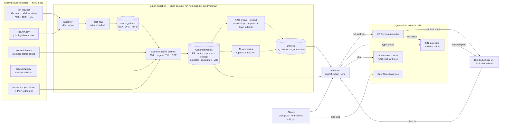

# Data Ingestion — Full-Stack Onboarding Guide

<!-- describes: alethical/pipeline/*.py, alethical/db/models.py, alethical/api/routers/me.py, alethical/api/services/representative_lookup.py -->

> Practical map of every data source Alethical pulls from, how each is fetched
> and parsed, how the pipeline is orchestrated, and what you need installed.
> Verified against the code on 2026-07-03. Companion design docs:
> [layer-1-source-ingestion-system-design.md](../architecture/layer-1-source-ingestion-system-design.md),
> [layer-2-rag-ingestion-system-design.md](../architecture/layer-2-rag-ingestion-system-design.md),
> [db-schema-system-design.md](../architecture/db-schema-system-design.md).

## TL;DR mental model

Alethical ingests **Minnesota legislative data by scraping official public
government sources** — there is no single vendor API and **no API keys are
needed for any government source**. Bills come from the MN Revisor (XML + HTML),
legislators from the joint Legislature roster + chamber profile pages, votes from
chamber-specific journals/pages, and district lookup from US Census + Minnesota address
points + local copies of official MN GIS boundaries. There are **two** credentialed dependencies: **Anthropic**
(`alethical/pipeline/anthropic_enrichment.py` — where every production bill summary
comes from today) and **OpenAI** (the batch summary backend + RAG chat). This guide
named only OpenAI, which pointed a new engineer at the wrong one.
Everything is orchestrated through an **Oban (Postgres-backed) job queue driven
from a CLI** — there is **no scheduler/cron**; a human runs the pipeline. All
batch ingestion is **dry-run by default** and **idempotent**.

Code: [`alethical/pipeline/`](../../alethical/pipeline) (batch) ·
[`alethical/api/`](../../alethical/api) (query-time) ·
[`scripts/`](../../scripts) (one-shot loaders). Config: [`.env.example`](../../.env.example).

## Pipeline flow (one page)



RAG embeddings use OpenAI `text-embedding-3-small` when `OPENAI_API_KEY` is set;
offline (tests / no key) they fall back to a deterministic SHA-256 hash — see the
**E & F — OpenAI** section. All flows are functional.

> Downloadable version of this diagram (for slides / offline):
> [SVG](../architecture/layers-1-2-ingestion-pipeline.svg).

## The two ingestion layers (and where the design depth lives)

The flow above spans **two ingestion pipelines**, and this guide is weighted toward the
first. Each has its own design doc; read those for the "why" and the quality bars this
operational guide doesn't repeat.

- **Layer 1 — source ingestion** (official sources → canonical records). Everything below
  in this guide — the source map, the per-source fetch/parse sections, roster
  reconciliation, orchestration, and provenance — is layer 1. Design doc:
  [`layer-1-source-ingestion-system-design.md`](../architecture/layer-1-source-ingestion-system-design.md)
  (the seven pipeline stages, source-authority split, and enrichment status).

- **Layer 2 — RAG ingestion** (canonical records → retrieval chunks for chat). Layer 2
  consumes layer 1's canonical bill text and turns it into cleaned, citation-safe chunks
  with embeddings. This guide covers only its operational edges — section-based chunking
  (~220-word target), `text-embedding-3-small` with a hash fallback (see **E & F —
  OpenAI**), the `bill-sync-chunk` worker, and `backfill_rag_bulk.py`. The parts it does
  **not** cover — the cleaning transforms (amendment-marker rewriting, whitespace/table
  normalization), the fidelity/cleanliness/legibility quality gates, the validation report,
  and the HNSW retrieval index — live in
  [`layer-2-rag-ingestion-system-design.md`](../architecture/layer-2-rag-ingestion-system-design.md).

Two adjacent AI uses are **not** layer 2 and are easy to conflate with it: **AI enrichment**
(bill summaries → `ai_enrichment`, section E) is a separate derivation from canonical data,
and **RAG chat synthesis** (section F) is query-time retrieval, not ingestion. Layer 2 is
specifically the ingestion that _builds the retrieval corpus_ those depend on.

## The source map

| #   | Domain                                   | Source                                                                                 | Protocol / Format                          | Auth             | Code                                                                                                                                 |
| --- | ---------------------------------------- | -------------------------------------------------------------------------------------- | ------------------------------------------ | ---------------- | ------------------------------------------------------------------------------------------------------------------------------------ |
| A   | Bills, actions, sponsors, versions, text | MN Revisor                                                                             | HTTP `GET`, XML + HTML                     | none             | [minnesota.py](../../alethical/pipeline/minnesota.py)                                                                                |
| B   | Legislator roster & profiles, committees | Joint directory + House/Senate member pages                                            | HTTP `GET`, HTML (regex)                   | none             | [minnesota.py](../../alethical/pipeline/minnesota.py), [committee_memberships.py](../../alethical/pipeline/committee_memberships.py) |
| C   | Roll-call votes                          | House vote pages + Senate journal API→PDF                                              | HTTP `GET`, HTML + JSON + PDF              | none             | [votes.py](../../alethical/pipeline/votes.py)                                                                                        |
| D   | District lookup (Find My Legislator)     | US Census geocoder + MN statewide address points + bundled official LCC-GIS boundaries | HTTP `GET` JSON + local compressed GeoJSON | none             | [representative_lookup.py](../../alethical/api/services/representative_lookup.py)                                                    |
| E   | AI bill summaries                        | OpenAI Batch API                                                                       | HTTPS, JSON                                | `OPENAI_API_KEY` | [ai_enrichment.py](../../alethical/pipeline/ai_enrichment.py)                                                                        |
| F   | RAG chat synthesis                       | OpenAI Responses API                                                                   | HTTPS `POST`, JSON                         | `OPENAI_API_KEY` | [me.py](../../alethical/api/routers/me.py)                                                                                           |
| G   | Map tiles                                | OpenStreetMap                                                                          | HTTP tiles                                 | none             | frontend `MapPinPicker.tsx`                                                                                                          |

**Every one of those `GET`s decodes through one helper, and it has to**
([http_text.py](../../alethical/pipeline/http_text.py)). Sources A, B and C each
have their own retrying fetch function, and each used to finish with
`return response.text`. That is a trap: `requests` takes the character set from the
`Content-Type` header, and when a `text/*` response names none it falls back to
ISO-8859-1 (RFC 2616 §3.7.1). Three of the pages we read send exactly that while
their bytes are UTF-8 — the Revisor's bill-status API (`text/xml`, whose XML even
_declares_ `encoding="UTF-8"` in a declaration that is thrown away once the body is
a decoded string), the Senate's member pages, and the Senate's journal index. Under
the fallback every UTF-8 byte became its own Latin-1 character, so Rep. María Isa
Pérez-Vega's name entered the pipeline as `Pérez-Vega` and reached 42 bills' author
rows, 2 bill descriptions and 1 office address that way
([#849](https://github.com/alethical-org/alethical/issues/849)). `response_text`
believes a stated charset, tries UTF-8 when none is stated, and keeps the RFC
fallback as the net for a source that really is Latin-1. **A new fetcher calls it
rather than `response.text`** — that one line is the whole defect, and a fifth
scraper written later should inherit the fix, not the bug.

**Timeframe scope:** the **94th Legislature (2025-2026)** — its regular session
(`session_code="0942025"` / `"0942026"`, session `94-2025-regular`, `bill_key`
`94-2025-{FILETYPE}{NUMBER}`, e.g. `94-2025-HF2136`) and its **2025 first special
session** (`session_code="1942025"`, session `94-2025-special-1`, `bill_key`
`94-2025s1-{FILETYPE}{NUMBER}`). The `s1` is load-bearing: a special session numbers
its files from 1 again, so `HF 5` exists in both and they are different bills (#746).
Which row a discovery code ingests into is declared in `SESSION_DEFINITIONS`
([sessions.py](../../alethical/pipeline/sessions.py)); an unmapped code raises rather
than defaulting into the current biennium. Supporting other biennia means adding
their definitions ([#359](https://github.com/alethical-org/alethical/issues/359)).

## A — Bills (MN Revisor)

The backbone. Three sequential fetches per bill through a retrying
`requests.Session` (User-Agent `Alethical Minnesota Ingest/0.1`, 30s timeout, 3
retries with linear backoff on `429/500/502/503/504`).

1. **Discovery / search** —
   `GET https://www.revisor.mn.gov/bills/status_result.php?body=House&search=basic&session=0942025&location=House&bill=2136&bill_type=bill&submit_bill=GO&keyword_type=all&format=xml`
   → `<BILL_RESULT>` XML (parsed with `ElementTree`) exposing `FILE_TYPE`,
   `FILE_NUMBER`, `DESCRIPTION`, and two discovered URIs: `STATUS_XML_URI` and
   `LATEST_TEXT_HTML_URI`. Full-session discovery walks bill numbers 1→6000 in
   chunks of 500 across both chambers.
2. **Bill status XML** (`STATUS_XML_URI`) → actions, authors/sponsors, companion
   bill, version inventory. Canonical spine for `bill`, `bill_action`,
   `sponsorship`, `bill_version`.
3. **Bill text HTML** (`LATEST_TEXT_HTML_URI`) → section headings + text via
   balanced-`<div>` regex parsing (no HTML library) → `bill_version_section` and
   the RAG chunker.

Reference URL shapes: `https://api.revisor.mn.gov/bills/v1/94/2025/0/HF/2136/` ·
`https://www.revisor.mn.gov/bills/94/2025/0/HF/2136/versions/0/`

### Re-fetches refuse 1 thin source response

Before an existing bill is changed, the importer compares the fetched counts of
actions, authors, text versions and sections with the last accepted response
([#1319](https://github.com/alethical-org/alethical/issues/1319)). A lower count
does not change any bill fact. It immediately fetches all 3 official responses again:

- a complete second fetch replaces the first one;
- the same lower facts twice corroborate a real source removal and may be saved;
- a failed or differently thin second fetch marks that bill's run failed and adds
  `bill_refresh_rejections[].needs_issue=true` to the chunk result;
- the chunk continues with its other bills, so 1 rejected bill does not undo up
  to 24 successful ones.

The future scheduled refresh
([#1323](https://github.com/alethical-org/alethical/issues/1323)) owns turning that
post-retry signal into a GitHub issue. A blank description is non-destructive: it
keeps the stored description, just as a blank parsed title keeps the stored title.

### A section's body is stored twice, and that is deliberate

`bill_version_section` holds each section's body in two columns, written together
by `parse_bill_section`:

- **`raw_text`** — the flat string, produced by stripping every tag. It loses the
  subdivision numbers ("Subd. 2."), the marks saying which words the bill _adds_,
  and the row/column shape of appropriation tables.
- **`body_blocks`** (JSON) — the same body as an ordered list of blocks that keeps
  all three: `{"kind": "heading", "number": "Subd. 3.", "text": "Health plan."}`,
  `{"kind": "para", "text": …}`, `{"kind": "table", "rows": [[cell, …], …]}`. Built
  by `parse_section_blocks`. Null on any section stored before that existed, so
  every reader must fall back to `raw_text`.

**Never "fix" `raw_text` to carry the structure instead.** Two paid caches hash it,
and rewriting it re-runs both corpus-wide jobs:

| cache                                | where it hashes `raw_text`                                                                                          | what a rewrite costs                            |
| ------------------------------------ | ------------------------------------------------------------------------------------------------------------------- | ----------------------------------------------- |
| every section's search embedding     | `rag_ingest.py` — `source_hash(section.raw_text)`; a mismatch re-chunks and re-embeds                               | paid re-embed of the whole corpus               |
| every bill's AI summary + key points | `ai_enrichment.py` folds the same hash into `source_version_hash`; `should_enqueue` re-runs a bill whose hash moved | paid re-run of the full ~10,400-bill enrichment |

Nothing hashes `body_blocks`, so filling it in is free. That is why the structure
lives in its own column and why the free backfill
(`scripts/backfill_bill_section_body_blocks.py`) writes **only** that column —
never `raw_text`, not even with the same value. Decided while fixing
[#741](https://github.com/alethical-org/alethical/issues/741) and
[#752](https://github.com/alethical-org/alethical/issues/752). A fresh ingest fills
the column itself, so only bills stored before that landed need the backfill.

**`bill_version_section.updated_at` is useless for dating a text change, and
2026-07-30 is why.** That backfill ran corpus-wide on 30 July 2026 and wrote
`body_blocks` on all 46,063 sections of every current version. `TimestampMixin`
bumps `updated_at` on any update, so **every section in the corpus carries that
date** while its `raw_text` was not touched at all. Anyone tracing who last changed
a section's text by timestamp will be misled into thinking the whole corpus was
rewritten that day. To date a _text_ change, compare `raw_text` against its hash
(`source_hash` on the row, or the search document's `source_hash`) — a row whose
stored hash no longer matches its text has had its text rewritten, whatever the
timestamp says. Two sections were found in exactly that state, both from the
duplicate-id data loss in
[#763](https://github.com/alethical-org/alethical/issues/763).

One trap in that comparison: `bill_version_section.source_hash` holds **either** the
full 64-character sha256 (`content_hash` in `alethical/pipeline/minnesota.py`) **or**
its 16-character prefix (`source_hash` in `alethical/pipeline/rag.py`), depending on
which writer last touched the row. Comparing against only one form reported 2,287
false mismatches out of 3,000 — which reads exactly like the corpus-wide disaster
this section exists to prevent.

## B — Legislators, profiles, committees

- **Roster (discovery):** `GET https://www.leg.mn.gov/leg/legislators` →
  regex-parsed into House + Senate members (name, district, profile URL, image).
  Sanity check: **134 House + 67 Senate seats** (the scrape lists seats, so a
  mid-biennium vacancy may still appear here).
- **House profile:** `https://www.house.mn.gov/members/profile/{id}` → party,
  district, office block, `@house.mn.gov` email, `651-` phone, committees.
- **Senate profile:** `http://www.senate.leg.state.mn.us/members/member_bio.php?leg_id={id}`
  → **separate adapter** (the HTML differs).
- **Committee memberships** are scraped from those same profile pages; a
  legislator with zero committees is valid (`committee_count = 0`).
- **Membership reconciliation (canonical PDF):** the HTML scrape only ever
  _adds/updates_ members, so a member who leaves mid-biennium lingers as
  `is_current`. The official printable roster PDF
  (`https://www.house.mn.gov/hinfo/leginfo/memroster.pdf`, linked as the "All
  Members Roster" from both `senate.mn` and `house.mn.gov`) is the canonical
  authority for **who currently holds each seat**. `reconcile_current_members`
  ([roster_pdf.py](../../alethical/pipeline/roster_pdf.py) +
  [minnesota.py](../../alethical/pipeline/minnesota.py)) parses it and sets
  `is_current = False` on any current member the PDF no longer lists (vacated,
  or the seat is now held by someone else). Rows are never deleted. Run it via
  `just reconcile-roster` (dry-run) / `just reconcile-roster apply=true`, or
  `scripts/load_minnesota_data.py --reconcile-only [--dry-run]`; the normal
  roster load also runs it when passed `--reconcile-roster`. **Re-run at each new
  biennium (~every 2 years, against the new `--session-slug`) and whenever a
  member leaves mid-session.** Spec:
  [legislator-roster-canonical-membership-spec.md](../architecture/legislator-roster-canonical-membership-spec.md).

## C — Roll-call votes (chamber-specific)

Revisor gives roll-call _totals_ (e.g. `34-33`) but not individual legislators, so
votes need dedicated adapters (User-Agent `Alethical Vote Backfill/0.1`):

- **House:** `GET https://www.house.mn.gov/votes/Details?...` (HTML) → parses
  `"N YEA and M Nay"` plus affirmative/negative name tables.
- **Senate:** two hops —
  1. `GET https://www.senate.mn/api/journal/gotopage?page={p}&ls=94` → JSON with
     `fileBiennium`, `filename`, `internal_page`.
  2. Download `https://www.senate.mn/journals/{biennium}/{filename}.pdf`, extract
     text with the **`pdftotext` CLI** (poppler — a system dependency), then
     regex-parse names.

Votes are **optional** — a bill legitimately has zero vote events if there was no
recorded roll call or the source can't be matched deterministically.

## D — District lookup (query-time, not batch)

Powers "Find My Legislator." Called synchronously by
`POST /api/v1/address-suggestions` while a reader types and by
`POST /api/v1/representative-lookups` for the final lookup. Three stages use public sources. The 2 address
sources have a 10s timeout and env-overridable URLs. A timeout, connection failure, or
`408`/`425`/`5xx` response gets 2 short retries after 0.2s and 0.6s. The second source
runs when Census finds nothing or stays unavailable after those retries:

1. **Geocode:** `GET https://geocoding.geo.census.gov/geocoder/locations/onelineaddress?address=...&benchmark=Public_AR_Current&format=json`
   → lat/lng + state (rejects non-MN). It first tries the address as typed. When an
   address explicitly says Minnesota but has no result, it ignores punctuation and extra
   spaces, separates the house and street from the city, and retries each safe reading with
   `MN`; this recovers homes whose commonly used city or ZIP differs from the postal record.
2. **Address suggestions and fallback:** once a partial address has an exact house number
   and 2 street-name characters, query Minnesota's official list by that house number and
   street prefix. A numbered street can start after 1 digit. Return up to 5 unique active
   addresses. The same source is the fallback after Census finds nothing or stays unavailable:
   query Minnesota's public statewide address points at
   `https://enterprise.gisdata.mn.gov/aghost/rest/services/us_mn_state_mngeo/loc_addresses_open/FeatureServer/0/query`.
   The request carries only the parsed house number and street name, never the city or ZIP.
   The house number stays exact. The street first matches exactly, then may differ by 1
   character only in a word with at least 5 characters. Exact ZIP, close city, street
   type, and direction rank the official results; equally close results become choices.
   The fallback refuses a close match when the state says its result list was cut short.
3. **District:** check the point against the official 2022 House, Senate, and
   congressional boundary files stored with the backend. The local copy contains the
   May 26, 2023 LCC corrections. It must contain all 134 House and 67 Senate district
   codes, every geometry must be valid, and the selected shape must cover the point.
   Geometry is reduced only for the browser map afterward. No address or coordinate is
   sent to LCC during a lookup.

The browser waits 300ms after typing stops and reuses each suggestion result for 60s.
Suggestions have their own 60-request-per-source-address limit, separate from the full
lookup. The browser also shares identical lookups already in progress and reuses a
successful result for 60s. The full-lookup endpoint still allows 10 requests per source address in 60s.
When that limit is reached it returns the remaining wait in `Retry-After`, and the page
shows the countdown before either lookup button can send another request.

Overrides: `ALETHICAL_CENSUS_GEOCODER_URL`, `ALETHICAL_CENSUS_BENCHMARK`,
`ALETHICAL_MN_ADDRESS_POINTS_URL`, `ALETHICAL_HTTP_TIMEOUT_SECONDS`,
`ALETHICAL_ADDRESS_SUGGESTION_RATE_PER_MIN`. CLI:
`python -m alethical.api.services.representative_lookup "<address>" --json`.

## E & F — the credentialed sources (Anthropic and OpenAI)

**E. AI bill summaries — Batch API** (base `https://api.openai.com/v1`):
`POST /v1/files` (`purpose=batch`, JSONL) → `POST /v1/batches`
(`endpoint=/v1/responses`, `completion_window=24h`) → poll `GET /v1/batches/{id}`
→ download `GET /v1/files/{output_file_id}/content`. Output is structured JSON
(`SUMMARY_SCHEMA`) written to `ai_enrichment`, one row per
`(bill_id, bill_version_id, enrichment_type, model_name, source_version_hash)`.
Those five columns are the row's identity: `apply` upserts on them
(`ON CONFLICT … DO UPDATE`), and a unique key spelt `NULLS NOT DISTINCT` makes the
database refuse a second row rather than trusting the writer to look first
([#927](https://github.com/alethical-org/alethical/issues/927), migration `0019`).
`is_current` is **not** part of that identity, and this guide used to say it was —
it marks which of a bill's rows is the one on display, which
`ix_ai_enrichment_bill_summary_current_unique` separately holds to one per bill.
Two further backends write the same schema. A local **Codex CLI** runs on the
`ai_codex` queue, touching prod only at `ai-apply`. And **Anthropic**
(`anthropic_enrichment.py`, `ANTHROPIC_API_KEY`) is the one every production summary
actually comes from — it was missing from this section, from the pipeline diagram, and
from the stage table above.

**F. RAG chat synthesis:** `POST https://api.openai.com/v1/responses` with an
"answer only from the provided bill text" system prompt over pgvector-retrieved
chunks. Query-time, via `POST /api/v1/me/chat-sessions/{id}/messages`.

> ⚠️ **Model IDs are inconsistent in code.** The in-file constants
> (`gpt-5.2`, `gpt-5.5`) are aspirational; the **effective defaults are the
> CLI/env values `gpt-4o-mini`** (`OPENAI_AI_ENRICHMENT_MODEL`,
> `OPENAI_RAG_CHAT_MODEL`). Set these explicitly.
>
> ⚠️ **RAG embeddings use OpenAI `text-embedding-3-small`** (1536-dim, matches
> the `Vector(1536)` column). Both ingest (`pipeline/rag_ingest.py`) and query
> (`api/routers/me.py::build_query_embedding`) call the OpenAI embeddings API.
> When `OPENAI_API_KEY` is not set (tests, local dev), both paths fall back to
> the deterministic hash embedding `_deterministic_embedding` so the pipeline
> remains exercisable offline; the stored `embedding_model` column distinguishes
> the two so a backfill will replace fallback rows when a key is present.
> Chunking is section-based (~220-word target).

## Orchestration — Oban job queue + CLI

All batch ingestion flows through an **Oban** Postgres-backed queue
([oban.py](../../alethical/pipeline/oban.py), config [oban.toml](../../oban.toml)). Two
DB **targets**: `local` (Docker Compose Postgres) and `production` (Supabase).

CLI: `uv run python -m alethical.pipeline.oban --target {local|production} {install|enqueue <kind>|drain <queue>}`

| Worker (`enqueue` kind)               | Queue (concurrency)     | Role                                                                      |
| ------------------------------------- | ----------------------- | ------------------------------------------------------------------------- |
| `pipeline-run`                        | `source_sync` (1)       | **Coordinator** — enqueues child stages                                   |
| `full-bill-sync`                      | `source_sync` (1)       | Discover all session bills                                                |
| `bill-sync-chunk`                     | `bill_sync` (**8**)     | Ingest a chunk of bills + build RAG                                       |
| `committee-backfill`                  | `committee_sync` (1)    | Committee memberships                                                     |
| `vote-backfill`                       | `vote_sync` (1)         | Roll-call votes                                                           |
| `rag-backfill` / `rag-backfill-chunk` | `rag_sync` (1)          | Rebuild retrieval chunks + embeddings. Both were missing from this table. |
| `ai-prepare` / `ai-apply`             | `ai_batch` / `ai_apply` | OpenAI Batch prepare/apply                                                |
| `codex-ai-*`                          | `ai_batch` / `ai_codex` | Local Codex enrichment                                                    |
| `smoke`                               | `maintenance` (1)       | Health check                                                              |

**`just pipeline-work` does not drain every queue in this table.** It covers
`source_sync`, `bill_sync`, `committee_sync`, `vote_sync` and `ai_batch`, so
`ai_apply`, `ai_codex` and `rag_sync` need a `drain` of their own
(`python -m alethical.pipeline.oban --target <t> drain <queue>`). A job sitting in one
of those three looks stuck when nothing is draining it.

**Safety:** jobs are `--dry-run` by default — pass `--write --allow-writes` to
persist. A **task-key dedupe** prevents duplicate concurrent jobs. Typical run
(via [justfile](../../justfile) wrappers):

```bash
just pipeline local --dry-run                 # preview
just pipeline-work local                       # drain the queues
just pipeline local --write --allow-writes     # commit after review
```

## Script & module entrypoints (manual / debugging)

| Command                                                                                  | Purpose                                                                                                                                                                                                         |
| ---------------------------------------------------------------------------------------- | --------------------------------------------------------------------------------------------------------------------------------------------------------------------------------------------------------------- |
| `uv run python scripts/load_minnesota_data.py`                                           | Live loader — roster + profiles + smoke bill set, idempotent (`--legislator-limit N`, `--bill HF2136`, `--roster-only`, `--skip-bills`, `--reconcile-roster`, `--reconcile-only [--dry-run]`, `--session-slug`) |
| `just reconcile-roster [apply=true]`                                                     | Reconcile current membership against the official roster PDF (dry-run by default; deactivates departed members). `ALETHICAL_DATABASE_TARGET=production` to target prod                                          |
| `uv run python scripts/load_sample_data.py`                                              | Deterministic fixtures for tests/offline demos (no network)                                                                                                                                                     |
| `uv run python scripts/backfill_rag_bulk.py`                                             | Threaded RAG backfill for current versions missing chunks                                                                                                                                                       |
| `uv run python -m alethical.pipeline.committee_memberships --cleanup-orphans`            | Committee repair/backfill                                                                                                                                                                                       |
| `uv run python -m alethical.pipeline.votes`                                              | Vote backfill (debug)                                                                                                                                                                                           |
| `uv run python -m alethical.pipeline.ai_enrichment {prepare\|submit\|status\|apply} ...` | Direct OpenAI Batch control. Four modes, not the two listed here: `prepare` builds the JSONL batch file and `apply` writes results back, which are the two you actually need to run a batch end to end.         |

## Provenance, idempotency & data layers

- **Raw:** every fetch recorded in `source_artifact` (content-hash, source URL,
  `fetched_at`, run id); `IngestionRun` tracks per-run stats.
- **Idempotency:** content-hash dedupe throughout; RAG sections rebuild only when
  the section hash changes; loaders upsert. Postgres advisory locks guard
  reference/district/legislator writes.
- **Layers:** Raw (`source_artifact`) → Canonical (`bill`, `bill_version`,
  `bill_action`, `sponsorship`, `vote_event`, `vote_record`, `legislator`,
  `district`, `committee`, `committee_membership`, `legislative_session`) →
  Derived (`rag_section_document` + chunks/embeddings, `ai_enrichment`, stats).
- **A fourth layer, for decisions a person made:** `legislator_campaign_committee`
  holds the checked link from one of our legislators to a Minnesota campaign
  committee's registration number ([#1354](https://github.com/alethical-org/alethical/issues/1354)).
  It is neither canonical nor derived: no source states it, and nothing computes
  it. `alethical/pipeline/legislator_committee_match.py` only *proposes* candidates
  and `scripts/review_legislator_campaign_committees.py` asks a person, so the only
  writer is someone answering a question. It is a separate layer because
  `docs/architecture/campaign-finance-system-design.md` §4.4 (What survives
  replacement) rebuilds the imported campaign-finance set on every load, and a human
  decision stored on an imported row would be destroyed silently.

## Environment & system prerequisites

- **Secrets/env:** `OPENAI_API_KEY` is the only external credential (AI/chat only;
  all gov scraping works without it). DB via `DATABASE_URL` or Supabase vars. See
  [`.env.example`](../../.env.example) for every variable, grouped by source, and
  [`CONTRIBUTING.md`](../../CONTRIBUTING.md) for setup.
- **System deps:** `uv`, Postgres **with pgvector**, and **`pdftotext`
  (poppler-utils)** for Senate votes; the `codex` CLI only for the Codex backend.

## Gotchas

1. **RAG embeddings need `OPENAI_API_KEY`** — with the key set they use OpenAI
   `text-embedding-3-small`; without it (tests, local dev) they fall back to a
   deterministic SHA-256 hash that is not semantically meaningful (see **E & F —
   OpenAI**). The stored `embedding_model` column distinguishes the two, so a
   keyed backfill replaces fallback rows.
2. **HTML parsing is regex-based, no schema validation** — an upstream template
   change yields _silently empty_ results, not a loud failure. Watch
   `IngestionRun` counts (roster is ~134 House / 67 Senate seats, **minus any
   current vacancies** — after membership reconciliation the current-member
   directory shows filled seats only, e.g. 133/67 while HD 21A is vacant; a bill
   shouldn't lose all actions/authors).
3. **No scheduler.** Ingestion is human-triggered via the CLI/justfile today.
4. **You're scraping public .gov sites** — be a polite citizen. The code sets a
   descriptive User-Agent and backs off on 5xx/429, but there's no global rate
   limiter.
5. **`local` vs `production` targets** — `--target production` writes to Supabase.
   Always dry-run first.
6. **Session is hardcoded to 94th/2025** in multiple places.
