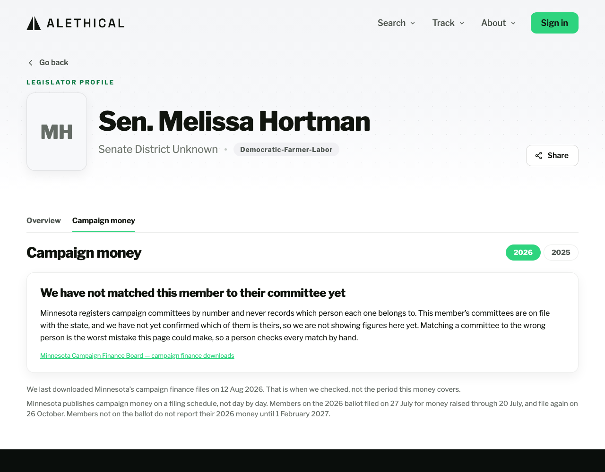
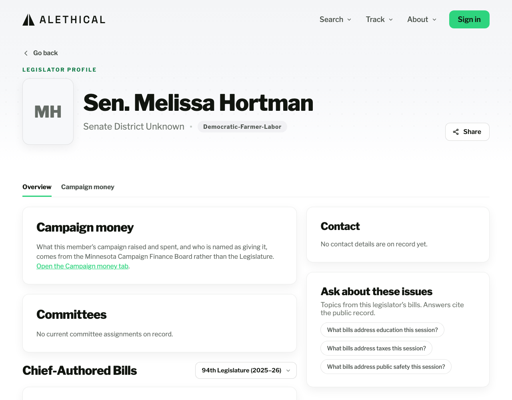

# How the Campaign money tab works (plain-English guide)

<!-- describes: apps/frontend/src/components/campaignMoney/CampaignMoneyTab.tsx, apps/frontend/src/components/legislator/OutsideSpendingCard.tsx, apps/frontend/src/lib/outsideSpending.ts, alethical/api/services/independent_spending.py, apps/frontend/src/components/campaignMoney/LegislatorProfileTabs.tsx, apps/frontend/src/lib/legislatorCampaignMoney.ts, apps/frontend/src/screens/redesign/LegislatorProfileWebScreen.tsx, apps/frontend/src/screens/redesign/LegislatorProfileMobileScreen.tsx, apps/frontend/src/navigation/webRoutes.ts, apps/frontend/src/navigation/links.ts, apps/frontend/src/data/api.ts, apps/frontend/src/hooks/useAppQueries.ts, alethical/api/services/legislator_finance.py, alethical/api/routers/public.py -->

Every current Minnesota House and Senate member's profile page has two tabs:
**Overview**, which is the page as it has always been, and **Campaign money**, which
shows what that member's campaign raised and spent in a calendar year and who is named
as giving it.

Built for [#1329](https://github.com/alethical-org/alethical/issues/1329). The rules it
answers to are
[campaign-finance-system-design.md §7 (Display rules)](https://github.com/alethical-org/alethical/blob/main/docs/architecture/campaign-finance-system-design.md)
and
[grounded-answers.md rule 12 (campaign-finance display)](https://github.com/alethical-org/alethical/blob/main/.claude/rules/grounded-answers.md).

---

## What every profile shows today

**Nothing yet, and that is the honest answer rather than a fault.** Minnesota registers
a campaign committee by number and never records which person it belongs to, so
somebody has to read each committee's name and confirm whose it is by hand. Nobody has
done that sitting yet, so all 200 sitting members show the same panel:

> **We have not matched this member to their committee yet**
>
> Minnesota registers campaign committees by number and never records which person each
> one belongs to. This member's committees are on file with the state, and we have not
> yet confirmed which of them is theirs, so we are not showing figures here yet.
> Matching a committee to the wrong person is the worst mistake this page could make,
> so a person checks every match by hand.

Three things that wording is careful about, because a shorter sentence gets each wrong:

- **It never says no committee is registered for this member.** All 200 sitting members
  do appear in the Board's own list of registered filers, so that sentence would be
  false for every one of them.
- **It says the unfinished work is ours.** A reader must not take a blank page as
  something the member did.
- **It says nothing about the other 199 members.** "No figures are on any profile" is
  true today and false the moment the first match is confirmed, and a sentence with an
  expiry date built into it is one somebody has to remember to change.

**The tab appears for every member regardless.** Hiding it until a match is confirmed
was proposed and rejected: two profiles side by side, one with a money tab and one
without, tell a reader the second member has no campaign money, when the truth is an
unfinished clerical job of ours.

---

## Getting to it

- The **Campaign money** tab sits next to **Overview** at the top of every legislator
  profile.
- Its own web address is `/legislators/<name>?tab=money`, and the year rides along as
  `&year=2025`. So a link somebody sends you opens on the same tab and the same year
  they were looking at.
- The Overview tab carries a short **Campaign money** card pointing at the tab. It
  deliberately carries **no figure**: a number there would drag a second "as of" date
  onto the Overview tab, which is the problem the two tabs exist to avoid.

---

## What the tab shows once a member is matched

A member can hold more than one committee, because Minnesota registers one per office.
17 sitting members tie to more than one, and 8 have 2 or more live at the same time. So
the tab shows **one card per committee**, each headed with the office it is for, the
year, and the committee's registration number.

**Money from a race for a different office never appears here.** A member may have run
for Attorney General or Governor, and those committees are real public records, but
putting that money under their legislative profile says something about their work in the
Legislature that no filing supports. The page leaves those out and says so in a line
carrying no figure, so a reader who knows about that campaign is told the money exists
rather than concluding we missed it.

The test is whether the committee is for a **legislative** office, not whether it matches
the seat the member holds now. Liz Reyer sits in the House and has a live Senate
committee as well; filtering to her own chamber would have thrown away a real committee
of hers. A committee with no office recorded is kept, because a blank field is not
evidence of another race and hiding a member's real money is the worse of the two
mistakes available.

### The year switch

Two buttons, top right: **this calendar year and the one before it**. Today that reads
2026 and 2025, and on 1 January 2027 it will read 2027 and 2026 without anyone editing
anything. The years are read off the calendar deliberately, because a written-down pair
would hide a new year from every reader and nothing would announce it.

Calendar years, because that is the unit Minnesota's own reports use. This is not the
same control as the session pill on the Overview tab, which counts a two-year
legislature.

Early in a year the newest option can be genuinely empty, and it says so rather than
showing a zero.

### Money in

Two figures, and they are different things:

- **Total this committee reported to the state.** The committee's own report, with the
  date it runs to stated underneath, and a link to the state's site where its filed
  reports can be looked up by registration number.
- **Donations with a donor's name.** The state publishes a spreadsheet of the donations
  it required each committee to name. This is what that spreadsheet holds for the year,
  with how many payments and the dates of the first and last one.

**Donations with nobody's name on them** is the difference between the two, shown as a
dollar figure and as a share. On a typical member roughly 4 dollars in 10 land here. The
sentence under it is fixed and says exactly this:

> Minnesota only makes candidates name a donor once that donor has given more than $200
> in total for the year. A campaign may name a smaller donor but does not have to, and for
> this money the state's public file does not say who gave it.

**Read that as the donor's yearly total, never the size of a single gift.** 327,759 of
the 583,152 published donation rows are individually under $200 and are named anyway,
because that donor's yearly total had already passed the line.

**And read it as a floor, not a ban.** The sentence used to end "Donors who gave $200 or
less in total are never named", which is not what the rule says: the $200 is the point at
which a campaign *has to* name someone, and a campaign may name a smaller donor if it
chooses. At least one does, so a reader who opened that filing and found a $75 donor listed
by name would have caught our page saying it was impossible
([#1755](https://github.com/alethical-org/alethical/issues/1755), corrected 27 Aug 2026).

Money in that is not a donation — a loan the candidate made to their own campaign, most
often — is listed separately under its own heading, with the state's own label. It is
never added to the donation figure, because the filing carries it on a different
schedule and the Board's own totals exclude it.

### Money out

**Payments we can list**, with a count and a breakdown by the state's own labels for the
kind of payment. There is no second, bigger number here, and the tab says so: Minnesota
publishes payments over $200 but publishes no official total for a committee's spending,
so there is nothing to compare against and no split to draw.

### Spending by outside groups

A group that is not a candidate's campaign can spend money to help or hurt that
candidate. Minnesota calls this an **independent expenditure**. **The money never reaches
the campaign and never appears in any report the campaign files**, so somebody reading
only the committee cards above would miss it entirely and have no way to know it was
missing. That is why this block sits on the same tab, below them, and never has its
figures added to theirs.

It shows the current calendar year and the one before, each with up to 3 figures.

| Figure | What it means |
| --- | --- |
| **Spent supporting them** | Payments Minnesota's filing marks `For` this legislator's committee. |
| **Spent opposing them** | Payments the filing marks `Against` it. |
| **Spent where the filing does not say which** | Payments whose `For` or `Against` cannot be read. |

Each figure carries **its own payment count**, because the payments behind one figure are
not the payments behind another. Below them the block states the span the payments
actually fall in, rather than assuming a year runs from 1 January, which a
special-election filer's report does not.

**And it names the committees the figures cover.** The figures add up every committee
somebody has confirmed belongs to this legislator, and a bare total would hide two things:
a member can hold several committees while only 1 has been reviewed, so the total can be a
fraction of their money presented as all of it, and a member can hold committees for
different offices, which the total would combine.

**The 2 sides are never added, subtracted or netted against each other**, and never drawn
as opposing halves of one shape. That a group spent money opposing a lawmaker is a fact
with a filing behind it; that it changed anything is not. Nothing here says the legislator
received, raised, welcomed or coordinated any of it.

**The third figure is usually absent, on purpose.** Every one of the 41,130 payments in the
current download records `For` or `Against` and none is blank, so that figure is $0 for
everybody today and is hidden while it is. A permanently empty row would tell a reader
Minnesota leaves the question open when it does not. It exists for the day Minnesota
publishes something the code cannot classify: before
[#1454](https://github.com/alethical-org/alethical/issues/1454) such a payment was dropped
from both sides while the page still read as complete.

**There is no $200 floor on this file.** 17,194 of its 41,130 payments are under $200 and
13,393 are under $100, the smallest being $0.00. The $200 that does exist in Minnesota law
is the *donor's yearly total* on the donations file described further up this guide, and it
does not apply here. This block says "told the state" rather than calling its figures all
outside spending, because nothing can know about spending nobody filed.

**Why it says nothing today, and it is the same reason as the committee cards.** Minnesota
records each payment against a committee, never against a person. Senator Omar Fateh is the
measured case: he is a sitting state senator and also ran for Minneapolis Mayor, and the
2025 filings carry 10 separate committees named "Fateh, Omar for Minneapolis Mayor" holding
$487,974.82 of supporting and $162,841.95 of opposing spending, while his Senate committee
has had none since 2022. A page matching on his name would put roughly $488,000 of a city
mayoral race on a state senator's legislative profile.

**The 4 answers this block can give**, which are 4 different things and not 4 ways of
saying zero:

1. **Real figures**, each to the cent.
2. **A checked zero** — no outside group reported spending anything about this legislator
   that year. The committee is confirmed and the download covers the year, so this is a
   published finding.
3. **No confirmed committee yet** — today's answer for everybody.
4. **A gap in our own copy** — a stale snapshot, a payment whose amount is blank, or a year
   the files do not reach. All 3 figures are withheld rather than published short by an
   unknown amount, because a figure short by an unknown amount and printed without a mark
   looks verified and is wrong.

Its own freshness date is shown as *Copied from the state on …*. The 2 years are 2 separate
requests, so if a new download becomes current between them the block shows **no** date
rather than one that is true of only some of the figures under it.

Built by [#1332](https://github.com/alethical-org/alethical/issues/1332) and
[#1454](https://github.com/alethical-org/alethical/issues/1454).

---

## When the tab shows no split, and why

The unnamed figure is *worked out* — the official total minus the donations we can list.
Every way that subtraction can go wrong is checked before it is printed, because a wrong
answer here does not look wrong. It looks like a fact about donors. In each case below
both official figures still appear; only the subtraction is withheld, and a sentence
says why.

| What the reader sees | When | How common |
| --- | --- | --- |
| "These two figures cover different stretches of time." | The committee's own report stops earlier than the donation spreadsheet does | 16 committee-years |
| "Minnesota publishes these two figures separately, and for this committee and year they do not agree." | The comparison against the committee's own filed report found the two official figures differ, in **either** direction | 62 committee-years, and **42** once the part-year correction below is applied |
| "The state's separate list of donations holds none of them for this year — so the names are missing from what we can show you, not from what the committee filed." | The filing names donors and our copy of the donation spreadsheet carries no row at all for that committee-year | 14 committee-years |
| "This committee filed its report for this year and then corrected it." | A subtraction refuses to run and the Board's catalogue records that the committee refiled the year's report | 1 committee-year |
| "These two figures will not line up, and we cannot tell why." | A subtraction refuses to run and nothing we hold says why | 0 committee-years |
| "The state has not published a report for this committee covering this year." | No official total we can stand behind for that year | 7,442 committee-years |
| "We cannot tell whether every donor stayed under the naming threshold or whether donations are missing from the list." | The committee reported money and the spreadsheet names none of it, and nobody has read the filing to find out which | 468 committee-years |

Counts measured against the live release on 19 August 2026, across every committee-year
the release covers rather than candidate committees alone. They are evidence, not a
requirement. Read them together: the 7,442 is mostly committee-years whose official total
was never published rather than a failure of anything, and 3,062 committee-years do show a
full split.

**And 20 of those 62 were never a disagreement, which is the correction of 28 August 2026.**
Minnesota names only the donors who had passed $200 by a report's own cut-off date. Its
separate donation spreadsheet carries the whole year's naming decision. So on a report
covering part of a year the two figures count different sets of donors, for a reason that is
nobody's mistake, and the check read the difference as the state contradicting itself. It now
accepts either reading of the same named money on a part-year report, which takes 20
committee-years out of this row. The 37 pages that carried the sentence for this reason
included the committees of Amy Klobuchar, Lisa Demuth, Keith Ellison and Steve Simon, both
legislative caucuses and both major state parties.

Two things this correction deliberately does not do. It leaves the other 27 differences
standing, because a difference the threshold does not explain is a real finding and 17 of
those 27 are our records holding more named money than the filing itemized for reasons
nothing we hold accounts for. And it never rescues a shortfall: dropping donors only makes
our figure smaller, so a filing that already names more than we hold moves further away, and
the largest genuine gaps stay visible.

**Three of those rows used to be one, and the shared sentence was false on two of them.**
Until 19 August 2026 a committee-year with no donation rows at all, and one whose two
figures simply would not subtract, both printed the disagreement sentence — which says
Minnesota's own publications contradict each other about a named committee. Neither had
any evidence for that: an empty spreadsheet has nothing on our side to disagree with the
filing, and a subtraction coming out negative tells you the two numbers will not subtract
and nothing about why. Splitting them apart is
[#1682](https://github.com/alethical-org/alethical/issues/1682) and
[#1648](https://github.com/alethical-org/alethical/issues/1648).

**Seven live committee pages printed it**, measured on production 19 August 2026 —
Kristin Robbins's governor committee (2025), IBEW - COPE (2024, 2025 and 2026), the Great
River Energy Action Team (2025), the 2nd Congressional District RPM (2025), and Wynfred
Russell's House committee (2026). The legislator tab this guide describes reached none of
them, because it needs a confirmed member-to-committee match and there are still none of
those; the committee pages shipped on 17 August need no such match, and they share this
wording. So this was a live wrong sentence about named committees, not a near miss.

**The disagreement row used to name a direction and it was the wrong one on 33 of those
76.** It said the listed donations "add up to more than the committee reported raising",
which is true of one of the two ways a page reaches that sentence and the reverse of the
truth on the other. The committee's own filed report naming money the spreadsheet does
not hold is the more serious of the two, because that money would otherwise be counted as
having no donor at all. Filer 20010's 2025 is the plain case: its filing itemizes
$1,493,418.08 and the spreadsheet holds $1,488,168.08. The sentence on screen now names
no direction, and a test pins that it never does again.

**Nobody had read it on a legislator's tab, and the first version of this paragraph
wrongly implied nobody could read it anywhere.** This tab only draws once a person has
confirmed which committee belongs to a member, and **no such confirmation exists yet** —
the table holding them (`legislator_campaign_committee`) has 0 rows in production, so
every member's tab currently shows the "nobody has confirmed which committee is theirs"
panel and never reaches a split or its explanation. **The committee pages are a different
story**: they arrived on 17 August 2026, they key on a registration number rather than a
person, and they print these same sentences today. So this was a wrong sentence sitting in shipped code, fixed before the
first confirmation made it visible, rather than a wrong sentence a reader saw. Recorded
this way round because the difference is the whole distance between a near miss and a
published falsehood, and the first telling of it took the credit for the wrong one.

The sharpest real case is the House Republican Campaign Committee's 2026: it reported
$399,275.76 through 31 March, and the donation spreadsheet names $881,816.24 of
donations through 20 July. Subtracting one from the other prints **minus $482,540.48**
of unnamed money, produced entirely by the two sources covering different months. So the
tab prints both figures and no subtraction.

---

## Missing, zero, and broken are three different things

- **"Not reported"** means the state's spreadsheet names nothing for this committee this
  year. It is never shown as "$0". A committee whose donors all stayed under the naming
  threshold is never itemized, so silence here is silence, not a zero.
- **"$0.00"** appears only where a committee genuinely reported nothing and the
  spreadsheet names nothing, and the two therefore agree.
- **A load failure gets its own message** and never falls through to "Not reported",
  because a fault on our side must not read as a named person having filed nothing.

---

## Dates, which are three separate things on this page

1. **Each payment list states the dates of the payments in it** — "Payments dated 6 Jan
   2026 to 20 Jul 2026". Those are the payments we hold, and the page never turns them
   into a claim about what period a filing covers.
2. **Each official total states the day its report runs to** — "covering through 31 Mar
   2026". A total whose coverage date falls outside the year on screen is not shown at
   all, because the Board's own service answers a request for a year it has no report
   for with the *previous* year's figures and nothing in the answer says so.
3. **One freshness date for the whole tab** — the day we downloaded Minnesota's files.
   It is not the period the money covers, and the tab says so in those words.

---

## Why a year has nothing to show, in the 6 different ways it can happen

Minnesota publishes campaign money **on a filing schedule, not day by day**. So a member
whose card is thin, or blank, is usually a member the state has not asked for a report
from yet. Without that said out loud, a reader in September sees "checked yesterday"
over figures that stop in July and concludes we are broken.

Until 27 August 2026 the tab said it **once, at the bottom, for everybody**: one fixed
paragraph reciting Minnesota's calendar in general, which left a reader to work out
which half of it applied to the member on screen. It also spelled 2026's dates out in
its own words, so on 1 January 2027 it would have quietly described a finished election
year and nothing would have announced it
([#1642](https://github.com/alethical-org/alethical/issues/1642)).

Now **each committee card carries its own sentence**, and there are 6 of them because
there are 6 genuinely different reasons. Every date in every one is read off the Board's
own published calendar for that committee and that year, so no date on screen is written
into our wording.

**Three of the 6 are facts about the committee:**

| The reader is told | When |
| --- | --- |
| It is on this year's ballot, so it is on the election-year schedule, and its next report is named with its due date and the stretch of time it covers | The state has scheduled a pre-primary or pre-general report for it this year |
| It is not on this year's ballot, so it is on the schedule for candidates who are not running, which asks for a report once a year rather than around each election | The year's election reports have come due and the state scheduled none for it |
| It closed its registration with the state on a named day, so no further report is due from it | The Board's filer record carries a termination date |

**The other 3 are our own unfinished work, and every one says so:**

| The reader is told | When |
| --- | --- |
| We cannot say, because it filed for a special election and special elections run on their own set of periods we have not written down | It has a special-election report this year |
| We cannot say, because we have not yet copied in the filing calendar covering this committee for this year | The year is one we have not transcribed, or the seat is a statewide or appellate one on a calendar this batch left out |
| We cannot say, because our copy of the state's own list of filings cannot answer it | No filings copied at all, this committee absent from the copy we have, or a copy taken too early to settle the question |

**Keeping those two halves apart is the whole point.** "We have not typed in that
calendar" and "nothing is due yet" are different facts, and letting the first read like
the second tells a reader something false about a named politician's duty to report.
That is [grounded-answers.md rule 12](https://github.com/alethical-org/alethical/blob/main/.claude/rules/grounded-answers.md)'s
missing-versus-zero rule applied to dates instead of to money. All 3 of ours share a
closing line — *"That gap is on our side and says nothing about this committee's own
filing"* — so they read as one class.

**Two things this wording never does, each pinned by its own test:**

- **It never says a report is late.** The signal that marks an unfiled report can only
  be read in the current year, so the claim cannot be supported, and telling a reader
  that a named politician missed a deadline they may not even have is the worst thing
  this tab could produce.
- **It never prints the pre-general date without the exemption the Board prints beside
  it.** That exemption reads *"Candidates who lost the primary election do not need to
  file this report."* Everyone who got past the primary owes the report and everyone who
  lost does not, and no record we hold says which happened. The date alone would invent
  a deadline for the losers; hiding the date would give the wrong answer to everyone
  else. So the exemption travels with the date, on its own line under it.

**One thing to expect and not mistake for a fault:** only Minnesota's 2026 calendars
have been transcribed, so switching the year to 2025 puts most committees into the
"we have not copied in that calendar" sentence. That is the honest answer, and copying
in another year's calendars is an edit to one file.

The states come from `alethical/api/services/committee_filing_schedule.py`, which reads
the Board's own filer record and its own report catalogue. The words come from
`apps/frontend/src/lib/legislatorCampaignMoney.ts`. That split is deliberate: the data
describes records and the page frames them.

---

## What this tab never says

- It never says money caused anything. No filing establishes that a donation changed a
  vote, and the tab shows records and connects nothing.
- It never ranks or compares members. Members sit on two different filing calendars, so
  on any day in 2026 one member's part-year total sits beside another member's figure
  covering different months, with nothing on screen to say so. Each member's figures
  carry their own dates instead.
- It never draws a chart of the named-versus-unnamed split. §7 describes one; it was
  left out of the first build deliberately, because a new chart implies a precision this
  data does not have while the plain figures do not. Raised as an open design question
  on [#1329](https://github.com/alethical-org/alethical/issues/1329).

---

## Where the data comes from

- **The donations and payments** come from Minnesota Campaign Finance Board bulk
  downloads, loaded by [#1328](https://github.com/alethical-org/alethical/issues/1328).
- **The official totals** come from the Board's own per-committee reports, loaded by
  [#1408](https://github.com/alethical-org/alethical/issues/1408).
- **The match between a member and a committee** is a row a named person wrote and
  signed ([#1354](https://github.com/alethical-org/alethical/issues/1354)). No score, no
  threshold and no name match ever creates one.
- **The reading and the split** are
  `alethical/api/services/legislator_finance.py`, served by
  `GET /api/v1/legislators/{id}/campaign-finance?year=YYYY`. No money is summed there:
  every figure comes from `alethical/pipeline/campaign_finance_reader.py`.

## What happens to reader data

Nothing is collected by this tab. It needs no sign-in, stores nothing about who read it,
and sends nothing anywhere. Every link out of it goes to the Minnesota Campaign Finance
Board's own site and opens in a new tab.
